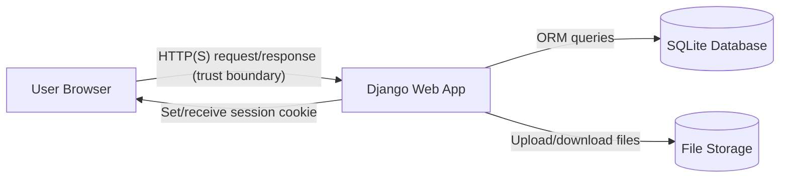
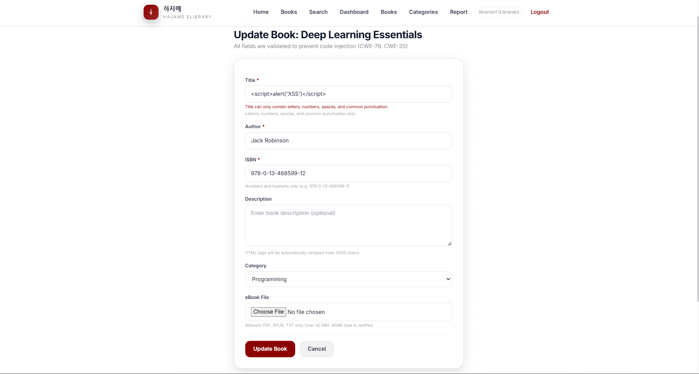
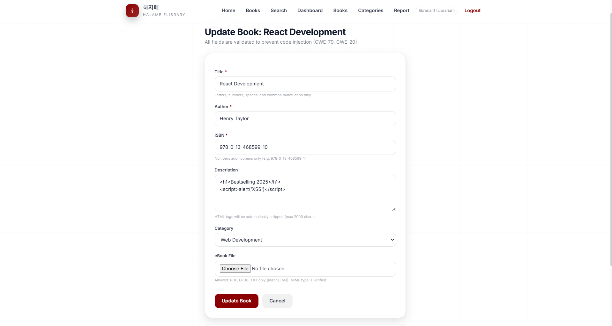
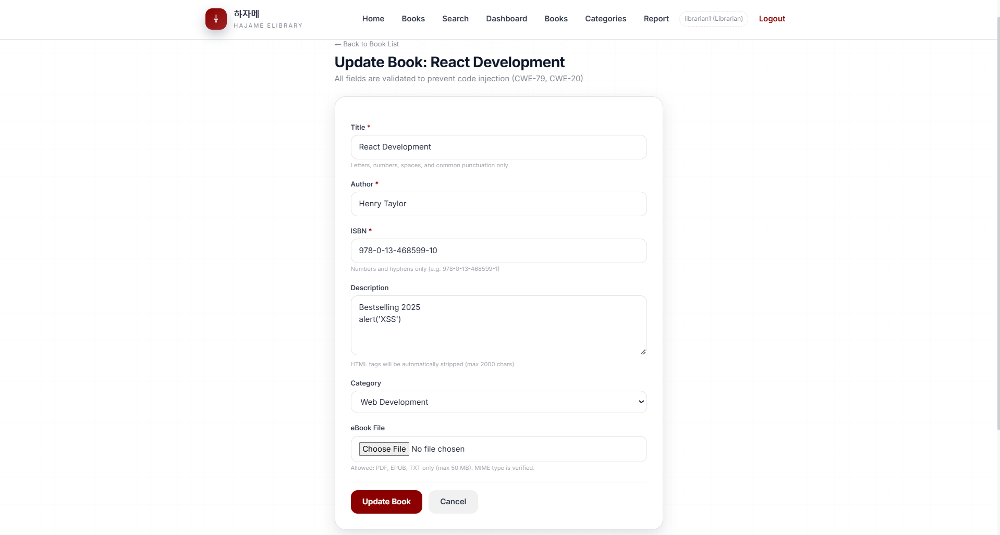
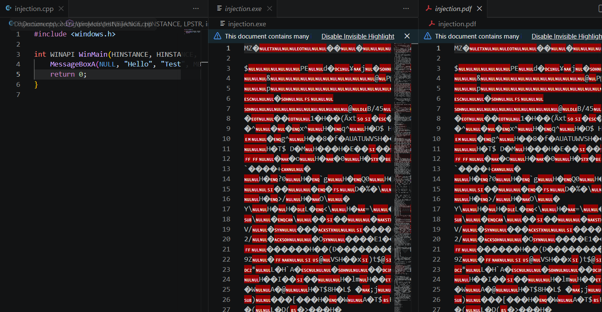
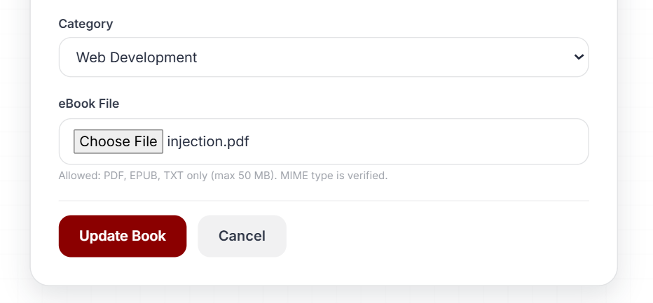
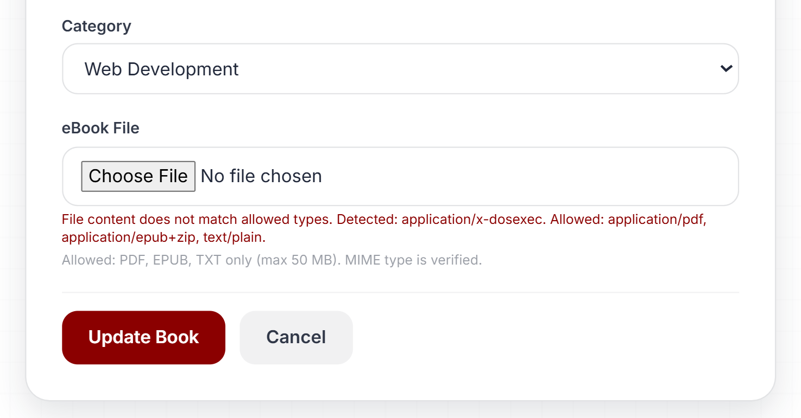

# Digital Library Management System — Laporan Tugas 4

**Kelompok: hacker-jangan-menyerang**

---

## 1. Link Video Demo

YouTube (Unlisted): [https://youtu.be/-giPyfFwNck](https://youtu.be/-giPyfFwNck)

---

## 2. Ringkasan Test Case

Semua test dijalankan dengan:
```bash
python manage.py test main.tests --verbosity=2
```

| TC-ID | Deskripsi | Precondition | Expected Result | Status |
|-------|-----------|--------------|-----------------|--------|
| **TC-SQLI-01** | Search dengan payload `' OR '1'='1'--` | DB berisi buku normal | Mengembalikan 0 hasil (payload di-escape ORM) | ✅ PASS |
| **TC-SQLI-02** | Login dengan username `admin' --` (SQL injection bypass) | User admin ada di DB | Login gagal — ORM tidak bisa di-bypass | ✅ PASS |
| **TC-SQLI-03** | Search dengan `; DROP TABLE book;--` | DB berisi buku | Tidak ada efek — tabel tetap ada | ✅ PASS |
| **TC-AUTH-01** | Login gagal 6x berturut-turut | Akun aktif, AXES dikonfigurasi | Percobaan ke-6 mendapat pesan lockout | ✅ PASS |
| **TC-AUTH-02** | Cek format password di DB | User terdaftar | Password tersimpan dalam format `pbkdf2_sha256$...` (bukan plaintext) | ✅ PASS |
| **TC-AUTH-03** | Logout, kemudian coba akses halaman member | User sedang login | Session tidak valid — redirect ke login | ✅ PASS |
| **TC-CSRF-01** | POST `/member/borrow/<id>/` tanpa CSRF token | Member login, buku tersedia | 403 Forbidden | ✅ PASS |
| **TC-CSRF-02** | POST dengan CSRF token salah/invalid | Member login | 403 Forbidden | ✅ PASS |
| **TC-CSRF-03** | POST dengan CSRF token valid | Member login, buku tersedia | 302 Redirect — borrow berhasil | ✅ PASS |
| **TC-IDOR-01** | Member A coba return buku milik Member B | Dua member berbeda, buku dipinjam Member B | 404 Not Found — ownership check mencegah akses | ✅ PASS |
| **TC-XSS-01** | Librarian tambah buku dengan title `<script>alert(1)</script>` | Librarian login | Form ditolak (regex validator menolak `<` dan `>`) | ✅ PASS |
| **TC-XSS-02** | Tambah kategori dengan payload XSS | Librarian login | Form ditolak (allowlist validator aktif) | ✅ PASS |
| **TC-INPUT-01** | Submit form tambah buku tanpa field wajib | Librarian login | Form ditolak dengan pesan error validasi | ✅ PASS |
| **TC-FILE-01** | Upload file `.exe` yang di-rename menjadi `.pdf` | Librarian login | Upload ditolak (MIME type check mendeteksi EXE) | ✅ PASS |
| **TC-ADMIN-01** | Member GET `/admin-panel/` | Member login | 403 Forbidden | ✅ PASS |
| **TC-ADMIN-02** | Librarian GET `/admin-panel/users/` | Librarian login | 403 Forbidden | ✅ PASS |
| **TC-ADMIN-03** | Admin GET `/admin-panel/users/` | Admin login | 200 OK — daftar user tampil | ✅ PASS |
| **TC-ADMIN-04** | Admin POST create user → cek DB dan AuditLog | Admin login | User ada di DB + entri `user_created` di audit_logs | ✅ PASS |
| **TC-ADMIN-05** | Admin POST toggle active pada akun sendiri | Admin login | Diblokir — `is_active` tetap `True`, pesan error tampil | ✅ PASS |
| **TC-ADMIN-06** | Admin ubah role member menjadi librarian | Admin login, member aktif | Role berubah di DB + entri `user_role_changed` di audit_logs | ✅ PASS |
| **TC-ADMIN-07** | `create_audit_log()` dengan details mengandung `'password'` | — | `ValueError` dilempar — tidak tersimpan ke DB | ✅ PASS |
| **TC-CSRF-LIB-01** | POST `/librarian/add-book/` tanpa CSRF token | Librarian login | 403 Forbidden | ✅ PASS |
| **TC-CSRF-LIB-02** | POST `/librarian/update-book/<id>/` tanpa CSRF token | Librarian login, buku ada | 403 Forbidden; buku tidak berubah | ✅ PASS |
| **TC-CSRF-LIB-03** | POST `/librarian/delete-book/<id>/` tanpa CSRF token | Librarian login, buku ada | 403 Forbidden; `is_deleted` tetap False | ✅ PASS |
| **TC-CSRF-LIB-04** | POST `/librarian/categories/add/` tanpa CSRF token | Librarian login | 403 Forbidden | ✅ PASS |
| **TC-CSRF-LIB-05** | POST `/librarian/categories/<id>/update/` tanpa CSRF token | Librarian login | 403 Forbidden; nama tidak berubah | ✅ PASS |
| **TC-CSRF-LIB-06** | POST `/librarian/categories/<id>/delete/` tanpa CSRF token | Librarian login | 403 Forbidden; kategori masih ada | ✅ PASS |
| **TC-CSRF-ADM-01** | POST `/admin-panel/users/create/` tanpa CSRF token | Admin login | 403 Forbidden; user tidak dibuat | ✅ PASS |
| **TC-CSRF-ADM-02** | POST `/admin-panel/users/<id>/toggle/` tanpa CSRF token | Admin login | 403 Forbidden; `is_active` tidak berubah | ✅ PASS |
| **TC-CSRF-ADM-03** | POST `/admin-panel/users/<id>/role/` tanpa CSRF token | Admin login | 403 Forbidden; role tidak berubah | ✅ PASS |
| **TC-CSRF-ADM-04** | POST `/admin-panel/users/<id>/edit/` tanpa CSRF token | Admin login | 403 Forbidden; username tidak berubah | ✅ PASS |
| **TC-SQLI-CREATE-01** | POST `/librarian/add-book/` dengan payload `' OR '1'='1'--` di description | Librarian login | Tidak ada 500 error; tabel books tetap utuh | ✅ PASS |
| **TC-SQLI-CREATE-02** | POST `/librarian/add-book/` dengan `' OR '1'='1'--` di title (mengandung `=`) | Librarian login | Form ditolak validator (allowlist tidak izinkan `=`) | ✅ PASS |
| **TC-SQLI-UPDATE-01** | POST `/librarian/update-book/<id>/` dengan `'; DROP TABLE books;--` di description | Librarian login, buku ada | Tidak ada 500 error; tabel books tetap utuh | ✅ PASS |
| **TC-SQLI-ADMIN-01** | POST `/admin-panel/users/create/` dengan `'; DROP TABLE users;--` di membership_number | Admin login | Tidak ada 500 error; tabel users tetap utuh | ✅ PASS |

---

## 3. Laporan Unit Testing

Unit testing menggunakan framework bawaan Django (`django.test.TestCase`), dijalankan dengan:

```bash
python manage.py test main --verbosity=2
```

Total **69 test** lulus dengan hasil **OK (0 failure, 0 error)**:


### 3.1 Code Injection Prevention (CWE-79 / 20 / 94) — Roberto Eugenio Sugiarto (2406355640)

Pengujian mitigasi injeksi kode dilakukan pada berkas `main/tests.py` melalui tiga kelas pengujian utama, yaitu `XSSPreventionTests`, `InputValidationTests`, dan `FileUploadSecurityTests`.

**Kelas `XSSPreventionTests`**
- `test_tc_xss_01_script_tag_in_book_title`: Memvalidasi pengiriman data untuk menambah buku yang mengandung karakter berbahaya. Sistem dipastikan menolak formulir tersebut guna memverifikasi daftar pola yang diperbolehkan pada atribut judul.
- `test_tc_xss_02_xss_in_category_name`: Berkaitan dengan penyimpanan kategori dengan payload berbahaya, memastikan sistem menolak injeksi script.
- `test_xss_in_description_stripped`: Mengonfirmasi bahwa pengguna yang mengunggah deskripsi dengan teks beralamat HTML akan tetap aman karena tag tersebut dibersihkan di sisi server sebelum tersimpan di basis data.
- `test_auto_escaping_in_template`: Membuat data teks dengan perintah kerentanan secara langsung di basis data dan memastikan sistem menampilkan tulisan asli tanpa mengeksekusinya di laman pengguna.

**Kelas `InputValidationTests`**
- `test_tc_input_01_missing_required_fields`: Menolak pengiriman form penambahan buku bilamana kolom wajib tidak diisi.
- `test_isbn_only_numbers_and_hyphens`: Menjamin ISBN tidak menerima sembarang karakter dan hanya menyetujui angka beserta tanda hubung.

**Kelas `FileUploadSecurityTests`**
- `test_tc_file_01_exe_disguised_as_pdf`: Memastikan bahwa berkas biner eksekusi dengan nama yang diubah menjadi PDF akan dihentikan sistem berdasarkan pemeriksaan tipe berkas secara menyeluruh.
- `test_exe_extension_rejected`: Menolak format aplikasi tak dikenal secara langsung sejak validasi ekstensi tahap awal.
- `test_valid_pdf_accepted`: Menyelesaikan rangkaian uji dengan mengizinkan dokumen sah agar berhasil masuk ke aplikasi tanpa memunculkan galat.

### 3.2 Broken Authentication Mitigation (CWE-287 / 307 / 256 / 384) — Kevin Cornellius Widjaja (2406428781)

**Diuji:** alur login & logout ([`main/auth_views.py`](main/auth_views.py)), registrasi ([`main/auth_views.py`](main/auth_views.py), [`main/forms.py`](main/forms.py)), dan dekorator RBAC ([`main/decorators.py`](main/decorators.py)). **Test:** [`main/tests.py`](main/tests.py), 9 test, semua PASS.

[Screenshot hasil test AuthenticationTests](assets/images/auth_unittest_pass.png)

#### `AuthenticationTests` — Rate Limiting, PBKDF2, Session Invalidation

Kelas ini memverifikasi tiga kontrol keamanan inti pada alur autentikasi (CWE-287 / 307 / 256 / 384):

| Method | TC-ID | Yang diuji | Cara kerja | Hasil yang diharapkan |
|--------|-------|------------|------------|----------------------|
| `test_tc_auth_01_login_lockout_after_5_failures` | TC-AUTH-01 | Rate limiting (CWE-307) | POST `/login/` dengan password salah sebanyak 7 kali; setiap percobaan dicatat oleh `django-axes`. Setelah 5 kali gagal, `axes` memblokir IP dan mengembalikan HTTP 429. | Setidaknya satu respons dalam rangkaian percobaan harus `429`; tidak ada percobaan yang berhasil masuk (bukan `200` dashboard) |
| `test_tc_auth_02_password_is_pbkdf2_hash` | TC-AUTH-02 | Penyimpanan password (CWE-256) | Membaca field `password` dari objek `User` di DB. Memverifikasi format `pbkdf2_sha256$<iterations>$<salt>$<hash>` (4 segmen dipisah `$`). | `user.password.startswith('pbkdf2_sha256$')` = `True`; nilai bukan plaintext `'testpass123'` |
| `test_tc_auth_03_session_invalidated_after_logout` | TC-AUTH-03 | Session management (CWE-384) | Login → simpan nilai `sessionid` → POST `/logout/` → buat client baru dengan cookie `sessionid` lama → GET `/member/`. | Respons adalah `302` ke `/login/`, bukan `200` (session lama tidak valid) |

Konfigurasi terkait di [`elibrary/settings.py`](elibrary/settings.py):
```python
AXES_FAILURE_LIMIT     = 5                       # lockout setelah 5 gagal
AXES_COOLOFF_TIME      = timedelta(minutes=15)   # durasi lockout
AXES_RESET_ON_SUCCESS  = True                    # reset counter saat login berhasil
SESSION_COOKIE_HTTPONLY = True                   # cegah akses JS ke cookie
SESSION_COOKIE_AGE      = 3600                   # session kedaluwarsa 1 jam
```

#### `RegisterFormTests` — Validasi Form Registrasi

| Method | Yang diuji | Hasil yang diharapkan |
|--------|------------|----------------------|
| `test_register_creates_user_with_role` | POST `/register/` dengan data member valid → user tersimpan ke DB dengan `role='member'` dan `membership_number` sesuai input | `302` redirect ke `/login/`; user ada di DB |
| `test_register_librarian_requires_employee_id` | POST dengan `role='librarian'` dan `employee_id` valid | `302` success; user tersimpan |
| `test_password_mismatch_validation` | POST dengan `password='pass123'` dan `password_confirm='differentpass'` | Bukan `302`; kata "password" muncul di halaman (pesan error) |

Form validasi diimplementasikan di [`main/forms.py`](main/forms.py) — method `clean()` membandingkan `password` dan `password_confirm`, melempar `ValidationError` jika tidak cocok.

#### `RoleRequiredDecoratorTests` — RBAC via `@role_required`

| Method | Yang diuji | Hasil yang diharapkan |
|--------|------------|----------------------|
| `test_member_cannot_access_librarian_view` | Member GET `/member/` (halaman khusus member) | `200 OK` — member bisa akses halaman role-nya sendiri |
| `test_librarian_cannot_access_member_only_view` | Librarian GET `/member/` | `403 Forbidden` — dekorator menolak role yang tidak cocok |
| `test_unauthenticated_access_redirects` | Unauthenticated GET `/member/` | `302` ke `/login/` — dekorator redirect jika belum login |

Dekorator `@role_required(*roles)` di [`main/decorators.py`](main/decorators.py) pertama memeriksa `request.user.is_authenticated`; jika tidak, redirect ke login. Kemudian memeriksa `request.user.role in roles`; jika tidak, mengembalikan `HttpResponseForbidden('403 Forbidden')`.

#### Coverage — `main` module

Dijalankan dengan:
```bash
python -m coverage run --source=main manage.py test main
python -m coverage report -m
```

Hasil:

| Module | Stmts | Miss | Cover |
|--------|-------|------|-------|
| `main/auth_views.py` | 122 | 12 | **90%** |
| `main/decorators.py` | 14 | 0 | **100%** |
| `main/forms.py` | 37 | 5 | 86% |
| `main/models.py` | 71 | 4 | 94% |
| `main/signals.py` | 25 | 3 | 88% |
| **TOTAL** | **1410** | **308** | **78%** |

`auth_views.py` mencapai 90% — 12 baris yang tidak tertutup adalah cabang error minor (mis. path redirect saat user sudah login membuka `/login/`). `decorators.py` 100% karena seluruh alur (authenticated + role cocok, authenticated + role salah, unauthenticated) dicakup oleh `RoleRequiredDecoratorTests` dan `RoleAccessTests`.

### 3.3 CSRF & IDOR Protection (CWE-352 / 639) — Benedictus Lucky Win Ziraluo (2406355174)

**Diuji:** proteksi CSRF pada seluruh endpoint write (member, librarian, admin) dan pencegahan IDOR pada return/history. **Test:** `CSRFProtectionTests`, `CSRFLibrarianEndpointTests`, `CSRFAdminEndpointTests`, dan `IDORPreventionTests` di `main/tests.py`, semua PASS.

**Ringkas hasil uji:**

| Kelas Test | Yang diuji | Hasil |
|-----------|-----------|-------|
| `CSRFProtectionTests` | POST tanpa token dan token salah pada `/member/borrow/<id>/` dan `/member/return/<id>/` | 403 Forbidden; token valid berhasil (borrow sukses, redirect) |
| `CSRFLibrarianEndpointTests` | POST tanpa token pada add/update/delete book dan add/update/delete category | 403 Forbidden pada semua 6 endpoint; data tidak berubah |
| `CSRFAdminEndpointTests` | POST tanpa token pada user_create, user_toggle, user_change_role, user_edit | 403 Forbidden pada semua 4 endpoint; state DB tidak berubah |
| `IDORPreventionTests` | Return transaksi milik member lain + history | Return milik member lain 404; history hanya menampilkan transaksi milik sendiri |


#### `CSRFLibrarianEndpointTests` — Semua Write Endpoint Librarian

| Method | Endpoint | Hasil yang diharapkan |
|--------|----------|-----------------------|
| `test_add_book_requires_csrf_token` | POST `/librarian/add-book/` | `403 Forbidden` |
| `test_update_book_requires_csrf_token` | POST `/librarian/update-book/<id>/` | `403 Forbidden` |
| `test_delete_book_requires_csrf_token` | POST `/librarian/delete-book/<id>/` | `403 Forbidden`; `is_deleted` tetap `False` |
| `test_add_category_requires_csrf_token` | POST `/librarian/categories/add/` | `403 Forbidden` |
| `test_update_category_requires_csrf_token` | POST `/librarian/categories/<id>/update/` | `403 Forbidden`; nama kategori tidak berubah |
| `test_delete_category_requires_csrf_token` | POST `/librarian/categories/<id>/delete/` | `403 Forbidden`; kategori masih ada di DB |

#### `CSRFAdminEndpointTests` — Semua Write Endpoint Admin

| Method | Endpoint | Hasil yang diharapkan |
|--------|----------|-----------------------|
| `test_user_create_requires_csrf_token` | POST `/admin-panel/users/create/` | `403 Forbidden`; user tidak dibuat |
| `test_user_toggle_requires_csrf_token` | POST `/admin-panel/users/<id>/toggle/` | `403 Forbidden`; `is_active` tidak berubah |
| `test_user_change_role_requires_csrf_token` | POST `/admin-panel/users/<id>/role/` | `403 Forbidden`; `role` tidak berubah |
| `test_user_edit_requires_csrf_token` | POST `/admin-panel/users/<id>/edit/` | `403 Forbidden`; username tidak berubah |

### 3.4 SQL Injection Prevention (CWE-89) — Vincent Valentino Oei (2406353225)

**Diuji:** search, login, create (add_book, user_create), update (update_book), dan inspeksi source code. **Test:** [`main/tests.py`](main/tests.py), 14 test, semua PASS.

Semua query database memakai Django ORM (parameterized query), sehingga payload injeksi hanya dianggap teks biasa (mitigasi CWE-89). Sebagai lapisan kedua, form login membatasi username dengan allowlist `^[a-zA-Z0-9_]+$`.

| Kelas Test | Yang diuji | Hasil |
|-----------|-----------|-------|
| `SQLInjectionSearchTests` | Payload `' OR '1'='1'--`, `'; DROP TABLE book;--`, dan `UNION SELECT` pada pencarian | Payload jadi teks biasa, hasil 0, tabel utuh, tidak ada data bocor |
| `SQLInjectionLoginTests` | Username `admin'--` dll. pada form login | Ditolak validasi, login gagal |
| `SQLInjectionModelTests` | Inspeksi kode search view | Tanpa `cursor.execute`, memakai `Q()` ORM |
| `SQLInjectionCreateUpdateTests` | Payload SQLi pada add_book (description), update_book (description), dan admin user_create (membership_number); inspeksi librarian_views dan admin_views | Tidak ada 500 error, tabel tetap utuh, ORM parameterized, tidak ada `cursor.execute` |

#### `SQLInjectionCreateUpdateTests` — Detail

| Method | Endpoint | Payload | Hasil yang diharapkan |
|--------|----------|---------|----------------------|
| `test_sqli_payload_in_add_book_description` | POST `/librarian/add-book/` | `' OR '1'='1'--`, `'; DROP TABLE books;--`, `UNION SELECT` di description | Tidak ada 500; tabel books tetap ada |
| `test_sqli_payload_rejected_by_title_validator` | POST `/librarian/add-book/` | `' OR '1'='1'--` di title | Form ditolak (title allowlist tidak mengizinkan `=`) |
| `test_sqli_in_update_book_no_error` | POST `/librarian/update-book/<id>/` | `'; DROP TABLE books; --` di description | Tidak ada 500; tabel books tetap ada |
| `test_sqli_in_admin_user_create_no_error` | POST `/admin-panel/users/create/` | `'; DROP TABLE users; --` di membership_number | Tidak ada 500; tabel users tetap ada |
| `test_no_raw_sql_in_librarian_views` | Inspeksi source `librarian_views.py` | — | Tidak ada `cursor.execute` |
| `test_no_raw_sql_in_admin_views` | Inspeksi source `admin_views.py` | — | Tidak ada `cursor.execute` |

### 3.5 Privilege Escalation Mitigation (CWE-269 / 285 / 862) — Galih Nur Rizqy (2406343224)

**Diuji:** kontrol akses berbasis role di seluruh panel admin ([`main/admin_views.py`](main/admin_views.py)), decorator RBAC ([`main/decorators.py`](main/decorators.py)), dan audit log ([`main/audit.py`](main/audit.py)). **Test:** `AdminFeatureTests`, `RoleAccessTests`, `LibrarianRBACTests` di `main/tests.py`, semua PASS.


#### `AdminFeatureTests` — Kontrol Akses Admin Panel (TC-ADMIN-01..07)

Kelas ini memverifikasi bahwa panel admin hanya dapat diakses dan dioperasikan oleh user dengan role `admin`, serta bahwa setiap aksi admin dicatat di `AuditLog` tanpa credential leakage (CWE-269 / 285 / 862):

| Method | TC-ID | Yang diuji | Cara kerja | Hasil yang diharapkan |
|--------|-------|------------|------------|----------------------|
| `test_tc_admin_01_member_blocked_from_admin_panel` | TC-ADMIN-01 | Least privilege (CWE-285) | Member `force_login` → GET `/admin-panel/` | `403 Forbidden` — `@role_required('admin')` menolak role `member` |
| `test_tc_admin_02_librarian_blocked_from_user_list` | TC-ADMIN-02 | Least privilege (CWE-285) | Librarian `force_login` → GET `/admin-panel/users/` | `403 Forbidden` — librarian tidak punya akses admin |
| `test_tc_admin_03_admin_can_list_users` | TC-ADMIN-03 | Akses sah (CWE-862) | Admin `force_login` → GET `/admin-panel/users/` | `200 OK` + username user lain terlihat di response body |
| `test_tc_admin_04_create_user_logs_audit` | TC-ADMIN-04 | Akuntabilitas (CWE-862) | Admin POST create user baru → cek DB dan AuditLog | User ada di DB + `AuditLog` berisi entri `user_created` |
| `test_tc_admin_05_admin_cannot_deactivate_self` | TC-ADMIN-05 | Self-modification protection (CWE-269) | Admin POST toggle active pada `user_id` dirinya sendiri | `is_active` tetap `True`; response bukan `200` tanpa pesan sukses |
| `test_tc_admin_06_role_change_logged` | TC-ADMIN-06 | Akuntabilitas role change (CWE-862) | Admin ubah role member → cek DB dan AuditLog | Role berubah di DB + entri `user_role_changed` di `audit_logs` |
| `test_tc_admin_07_audit_log_no_password_leak` | TC-ADMIN-07 | Credential leakage prevention (CWE-532) | Panggil `create_audit_log()` dengan `details` mengandung substring `'password'` | `ValueError` dilempar — data tidak tersimpan ke DB |

Implementasi perlindungan self-deactivation di [`main/admin_views.py`](main/admin_views.py):
```python
if target_user.id == request.user.id:
    messages.error(request, 'You cannot deactivate your own account.')
    return redirect('main:user_detail', user_id=target_user.id)
```

Perlindungan credential leakage di [`main/audit.py`](main/audit.py):
```python
if any(kw in details.lower() for kw in ('password', 'token')):
    raise ValueError("AuditLog.details must not contain credentials.")
```

#### `RoleAccessTests` — Cross-Role Access Prevention

| Method | Yang diuji | Hasil yang diharapkan |
|--------|------------|----------------------|
| `test_member_can_access_member_dashboard` | Member GET `/member/` | `200 OK` |
| `test_librarian_cannot_access_member_dashboard` | Librarian GET `/member/` | `403 Forbidden` |
| `test_unauthenticated_redirects_to_login` | Unauthenticated GET `/member/` | `302` ke `/login/` |

#### `LibrarianRBACTests` — Librarian Role Isolation

| Method | Yang diuji | Hasil yang diharapkan |
|--------|------------|----------------------|
| `test_librarian_can_access_dashboard` | Librarian GET `/librarian/` | `200 OK` |
| `test_member_cannot_access_librarian_dashboard` | Member GET `/librarian/` | `403 Forbidden` |
| `test_member_cannot_add_book` | Member POST `/librarian/books/add/` | `403 Forbidden` |
| `test_unauthenticated_redirects` | Unauthenticated GET `/librarian/` | `302` ke `/login/` |

---

## 4. Laporan Pentesting

Pentesting dilakukan dalam 5 tahapan sesuai ketentuan tugas. Target uji: aplikasi yang berjalan di `http://127.0.0.1:8000/`.

### 4.1 Reconnaissance (Passive & Active) — Vincent Valentino Oei (2406353225)

Tools: nmap, curl, OWASP ZAP. Target: `http://127.0.0.1:8000/`.

**Teknologi aplikasi:** Django (dev server WSGIServer, Python 3.12), database SQLite, rate limiting django-axes, frontend Tailwind CSS via CDN, password hashing PBKDF2.

**Daftar endpoint** (ringkasan):

- Publik dan Member: `/register/`, `/login/`, `/logout/`, `/books/`, `/books/search/`, `/books/<id>/`, `/member/borrow/<id>/`, `/member/return/<id>/`, `/member/history/`, `/member/read/<id>/`
- Librarian: `/librarian/`, `/librarian/books/`, `/librarian/categories/`, `/librarian/report/`
- Admin: `/admin-panel/`, `/admin-panel/users/`, `/admin-panel/users/<id>/role/`, `/admin-panel/audit-log/`, `/admin-panel/lockouts/`

**nmap** (`nmap -sV -p 8000 -A 127.0.0.1`): port 8000 terbuka, server `WSGIServer/0.2 CPython/3.12.10` (versi bocor).


**curl** (`curl -I`): header `X-Frame-Options`, `X-Content-Type-Options`, `Referrer-Policy`, dan COOP sudah ada; CSP dan HSTS belum ada.


**OWASP ZAP** (passive scan): 10 alert, yaitu 0 High, 2 Medium (CSP dan SRI tidak diset), 4 Low, 4 Info. Laporan lengkap: [`assets/zap_report.html`](assets/zap_report.html).


Kesimpulan: tidak ada temuan High. Isu utama yaitu CSP dan HSTS belum diset serta server version disclosure (melengkapi config bug Bagian 4.4).

### 4.2 Threat Modeling

**Data Flow Diagram (DFD):**



**Trust boundaries:**

- Browser <-> Django app (public network, attacker-controlled client).
- Django app <-> Database/File storage (internal server boundary).

**STRIDE per halaman/fitur (pemetaan ke CWE):**

| Halaman/Fitur | STRIDE | CWE | Contoh ancaman | Impact | Likelihood | Prioritas |
|--------------|--------|-----|----------------|--------|------------|-----------|
| Login (`/login/`) | Spoofing | CWE-287 | Kredensial ditebak/credential stuffing untuk menyamar sebagai user lain | Akses penuh ke akun korban | Tinggi | 1 |
| Login (`/login/`) | DoS | CWE-307 | Brute force berulang menyebabkan lockout atau gangguan layanan | Lockout akun sah | Tinggi | 2 |
| Register (`/register/`) | Elevation | CWE-269 | Tampering parameter role untuk mendaftar sebagai admin/librarian | Akses penuh ke panel admin | Sedang | 3 |
| Search (`/books/search/`) | Tampering / Info Disclosure | CWE-89 | SQL injection untuk membaca data sensitif | Data leakage / korupsi DB | Sedang | 2 |
| Borrow/Return (`/member/borrow/<id>/`, `/member/return/<id>/`) | Tampering | CWE-352 | CSRF memaksa user meminjam/return tanpa consent | Transaksi tidak sah atas nama user | Sedang | 3 |
| Borrow/Return (`/member/return/<id>/`, `/member/history/`) | Info Disclosure / Elevation | CWE-639 | IDOR akses transaksi milik member lain | Manipulasi data member lain | Sedang | 3 |
| Librarian book/category forms (`/librarian/books/`, `/librarian/categories/`) | Tampering | CWE-79, CWE-20 | XSS atau input berbahaya pada judul/kategori | Eksekusi script di browser admin/member | Rendah | 4 |
| Admin/Librarian pages (`/admin-panel/`, `/librarian/`) | Elevation | CWE-285 | Akses halaman privileged tanpa otorisasi | Kendali penuh atas sistem | Tinggi | 1 |

### 4.3 Scanning & Enumeration

Scanning dilakukan dengan dua tool: **OWASP ZAP** (otomatis) dan **curl** (manual header inspection).

**OWASP ZAP Passive Scan** dijalankan terhadap `http://127.0.0.1:8000/` dengan autentikasi sebagai member. Hasilnya: **0 High, 2 Medium, 4 Low, 4 Informational**.

Alert Medium:
- *Content Security Policy (CSP) Header Not Set* — CSP tidak diset, membuka potensi XSS via inline script dari CDN.
- *Sub Resource Integrity (SRI) Not Set* — Tailwind CSS dimuat dari CDN tanpa integrity hash; file CDN yang dikompromikan bisa menjalankan script berbahaya.

Alert Low (ringkasan):
- *Server Leaks Version Information via "Server" HTTP Response Header*
- *Missing Anti-clickjacking Header* (X-Frame-Options sudah ada via Django SecurityMiddleware, ZAP versi ini masih flag)
- *Strict-Transport-Security Header Not Set*
- *X-Content-Type-Options Header Missing* (sebagian endpoint)

Laporan lengkap: [`assets/zap_report.html`](assets/zap_report.html).


**curl header inspection** (`curl -I http://127.0.0.1:8000/login/`) mengkonfirmasi response headers yang ada dan yang tidak ada:


Tidak ditemukan endpoint yang mengembalikan data SQL error atau stack trace pada input berbahaya — semua payload diproses melalui Django ORM dan dikembalikan sebagai 0 hasil atau form error biasa.

### 4.4 Exploitation & Testing

Setiap pemilik topik mendemonstrasikan serangan pada fiturnya langsung di browser dan menunjukkan bahwa serangan gagal/diblokir.

#### SQL Injection (CWE-89) — Vincent Valentino Oei (2406353225)

Empat payload SQL injection diuji langsung melalui endpoint pencarian (`/books/search/`) dan form login. Semua gagal karena aplikasi memperlakukan payload sebagai teks biasa (memakai Django ORM, parameterized query).

**1. Boolean-based, `' OR '1'='1'--`:** pencarian mengembalikan 0 hasil, bukan seluruh tabel.


**2. Stacked query / DROP TABLE, `'; DROP TABLE books;--`:** 0 hasil, tanpa error, dan tabel tetap utuh (DROP tidak dieksekusi).


**3. UNION-based, `' UNION SELECT username,password FROM users--`:** 0 hasil, tidak ada username atau password yang bocor.


**4. Authentication bypass, login username `admin'--`:** login gagal. Username ditolak allowlist regex pada form login dan tidak pernah mencapai database (terverifikasi pada unit test TC-SQLI-02, lihat Bagian 3.4).

**Temuan (F-SQLI):**

| ID | Serangan | Affected Endpoint | CWE | Status | Impact | Reproduction Steps | Evidence |
|----|----------|-------------------|-----|--------|--------|--------------------|----------|
| F-SQLI-01 | Boolean-based injection (`' OR '1'='1'--`) | `/books/search/` | CWE-89 | Aman | Tidak ada data bocor, 0 hasil | GET `/books/search/?q=' OR '1'='1'--` | `sqli_pentest_1.png` |
| F-SQLI-02 | Stacked query `DROP TABLE` | `/books/search/` | CWE-89 | Aman | Tabel tetap utuh | GET `/books/search/?q='; DROP TABLE books;--` | `sqli_pentest_2.png` |
| F-SQLI-03 | UNION-based data exfiltration | `/books/search/` | CWE-89 | Aman | Tidak ada data bocor | GET `/books/search/?q=' UNION SELECT username,password FROM users--` | `sqli_pentest_3.png` |
| F-SQLI-04 | Auth bypass login | `/login/` | CWE-89 | Aman | Login gagal, ditolak validasi | POST `/login/` dengan username `admin'--` | Unit test TC-SQLI-02 |

Kesimpulan: tidak ditemukan kerentanan SQL injection. Seluruh input dieksekusi melalui Django ORM, diperkuat validasi input allowlist pada form login.

#### CSRF & IDOR (CWE-352 / 639) — Benedictus Lucky Win Ziraluo (2406355174)

CSRF diuji dengan request POST manual saat login member; request tanpa token dan token salah ditolak (403). IDOR diuji dengan mencoba return transaksi milik member lain dan menghasilkan 404.

**1. CSRF token missing:** POST `/member/borrow/<id>/` tanpa token -> 403 Forbidden.


**2. CSRF token invalid:** POST `/member/borrow/<id>/` dengan token salah -> 403 Forbidden.


**3. IDOR return milik member lain:** Member A mengakses `/member/return/<id>/` milik Member B -> 404 Not Found.


**Temuan (F-CSRF):**

| ID | Serangan | Affected Endpoint | CWE | Status | Impact | Reproduction Steps | Evidence |
|----|----------|-------------------|-----|--------|--------|--------------------|----------|
| F-CSRF-01 | CSRF token missing pada borrow | `/member/borrow/<id>/` | CWE-352 | Aman, 403 | Tidak ada | POST tanpa header `csrfmiddlewaretoken` | `csrftokenmissing.png` |
| F-CSRF-02 | CSRF token invalid pada borrow | `/member/borrow/<id>/` | CWE-352 | Aman, 403 | Tidak ada | POST dengan `csrfmiddlewaretoken=INVALID` | `csrftokeninvalid.png` |
| F-CSRF-03 | IDOR return milik member lain | `/member/return/<id>/` | CWE-639 | Aman, 404 | Tidak ada | Login sebagai Member A, POST `/member/return/<id_transaksi_B>/` | `idortest.png` |

#### Broken Authentication (CWE-287 / 307 / 256 / 384) — Kevin Cornellius Widjaja (2406428781)

Tiga skenario serangan diuji langsung pada aplikasi yang berjalan di `http://127.0.0.1:8000/`.

**1. Brute-force login → Account Lockout (TC-AUTH-01)**

Username `member1` digunakan dengan password salah secara berulang melalui form login `/login/`. Setelah percobaan ke-5, `django-axes` memblokir IP. Percobaan ke-6 mengembalikan halaman dengan pesan lockout (HTTP 429) dan tidak mengizinkan masuk meskipun password benar.

Konfigurasi: `AXES_FAILURE_LIMIT = 5`, `AXES_COOLOFF_TIME = timedelta(minutes=15)`.


**2. Cek kolom password di database — PBKDF2 hash (TC-AUTH-02)**

Kolom `password` pada tabel `users` diperiksa langsung di `db.sqlite3`. Hasilnya:
```
admin      | pbkdf2_sha256$1200000$<salt>$<hash>
librarian1 | pbkdf2_sha256$1200000$<salt>$<hash>
```
Tidak ada satu pun akun yang menyimpan password dalam bentuk plaintext. Django secara otomatis menggunakan PBKDF2-SHA256 dengan 1.200.000 iterasi melalui `create_user()`.


**3. Reuse session cookie setelah logout (TC-AUTH-03)**

Prosedur: (a) login sebagai `member1`, catat nilai cookie `sessionid` dari DevTools; (b) klik Logout; (c) buka tab Incognito, set cookie `sessionid` ke nilai lama, akses `/member/`. Hasilnya: browser di-redirect ke `/login/` — session lama tidak dikenali server karena `logout()` memanggil `session.flush()` yang menghapus data sesi dari store.


**Temuan (F-AUTH):**

| ID | Serangan | Affected Endpoint | CWE | Severity | Status | Impact | Reproduction Steps | Evidence | Rekomendasi |
|----|----------|-------------------|-----|----------|--------|--------|--------------------|----------|-------------|
| F-AUTH-01 | Brute-force login (> 5 percobaan gagal) | `/login/` | CWE-307 | High | **Aman** — HTTP 429 setelah 5 gagal | Tidak ada; lockout aktif | POST `/login/` dengan password salah ≥ 6 kali berturut-turut | `auth_login_locked.png`, TC-AUTH-01 | Konfigurasi sudah tepat; pertimbangkan notifikasi email saat lockout |
| F-AUTH-02 | Password disimpan plaintext di database | `/register/`, DB | CWE-256 | Critical | **Aman** — PBKDF2-SHA256 1.2M iterasi | Tidak ada | `sqlite3 db.sqlite3 "SELECT password FROM users LIMIT 1;"` | `auth_pbkdf_hashed.png`, TC-AUTH-02 | Tidak ada tindakan lanjut; sudah best-practice |
| F-AUTH-03 | Reuse session token setelah logout | `/member/` | CWE-384 | High | **Aman** — session lama diinvalidasi | Tidak ada | Login → logout → gunakan sessionid lama di Incognito | `auth_logout_code.png`, TC-AUTH-03 | Sudah aman; tambahkan `SESSION_COOKIE_SECURE=True` saat deploy ke HTTPS |
| F-AUTH-04 | Self-registration ke role Admin/Librarian | `/register/` | CWE-287 | Medium | **Rentan** (by design untuk demo) | Akses penuh ke admin panel | Isi form registrasi dengan role `Admin`, submit | Form registrasi | Batasi pilihan role di `/register/` ke `member` saja pada production |

#### Privilege Escalation & Misconfiguration (CWE-269 / 285 / 862) — Galih Nur Rizqy (2406343224)

Pengujian dilakukan dalam dua kelompok: (a) verifikasi kontrol akses RBAC dan (b) temuan konfigurasi nyata yang menjadi celah keamanan.

##### A. RBAC Testing

**1. Member mencoba akses `/admin-panel/` (TC-ADMIN-01)**

Login sebagai `member1 / member123`, navigasi langsung ke `http://127.0.0.1:8000/admin-panel/`. Django mengembalikan 403 Forbidden karena decorator `@role_required('admin')` menolak role `member`.


**2. Librarian mencoba akses `/admin-panel/users/` (TC-ADMIN-02)**

Login sebagai `librarian1 / librarian123`, navigasi ke `/admin-panel/users/`. Django mengembalikan 403 Forbidden — librarian tidak memiliki role `admin`.


**3. Admin tidak bisa deactivate dirinya sendiri (TC-ADMIN-05)**

Login sebagai `admin / admin123`, masuk ke halaman user list. Tombol Deactivate untuk akun admin sendiri tidak ditampilkan di UI (UI-level protection). Backend juga menolak POST request langsung via curl:

```bash
curl -c cookies.txt -b cookies.txt -s \
  -X POST http://localhost:8000/admin-panel/users/1/toggle/ \
  -d "csrfmiddlewaretoken=<token>" \
  -H "Referer: http://localhost:8000/admin-panel/users/" \
  -w "\nHTTP Status: %{http_code}\n"
```


##### B. Config Vulnerability Findings

**Finding F-PRIV-01 — DEBUG=True (Information Disclosure)**

`elibrary/settings.py` baris `DEBUG = os.getenv('DEBUG', 'True') == 'True'` — default bernilai `True`. Saat URL tidak ditemukan, Django menampilkan halaman debug penuh berisi path file server, versi library, dan konfigurasi environment.


**Finding F-PRIV-02 — Missing Security Headers**

Response headers aplikasi tidak mengandung `Content-Security-Policy`, `Strict-Transport-Security`, atau `X-Content-Type-Options`. Dikonfirmasi via DevTools → Network → Response Headers.


**Finding F-PRIV-03 — Self-Registration Sebagai Role Privileged**

Halaman `/register/` menampilkan semua pilihan role termasuk `Admin` dan `Librarian`. User anonim dapat mendaftar langsung sebagai Admin dan mengakses seluruh panel admin.


**Finding F-PRIV-04 — Akun Admin Hasil Self-Register Bisa Akses Panel Admin**

Setelah mendaftar dengan role Admin melalui `/register/`, akun baru berhasil login dan mengakses `/admin-panel/` dengan penuh.


**Temuan (F-PRIV):**

| ID | Temuan | Affected Endpoint | CWE | Severity | Status | Impact | Reproduction Steps | Evidence | Rekomendasi |
|----|--------|-------------------|-----|----------|--------|--------|--------------------|----------|-------------|
| F-PRIV-01 | Member/Librarian dapat akses halaman admin via URL langsung | `/admin-panel/`, `/admin-panel/users/` | CWE-285 | High | **Aman** — 403 Forbidden oleh `@role_required('admin')` | Tidak ada | Login sebagai member → GET `/admin-panel/` | `rbac_1.png`, `rbac_2.png` | Sudah terimplementasi |
| F-PRIV-02 | Admin bisa self-deactivate (self-lockout) | `/admin-panel/users/<id>/toggle/` | CWE-269 | Medium | **Aman** — diblokir UI + backend check | Tidak ada | Login sebagai admin → POST toggle pada user_id diri sendiri | `rbac_3.png` | Sudah terimplementasi |
| F-PRIV-03 | `DEBUG=True` — halaman error bocorkan info internal | Semua endpoint (404/500) | CWE-215 | Medium | **Rentan** — stack trace terekspos | Path file server, versi library, env vars | Akses URL tidak terdaftar, mis. `/nonexistent/` | `config_bugs_1.png` | Set `DEBUG=False` di production; gunakan env var |
| F-PRIV-04 | Missing `Content-Security-Policy` dan `Strict-Transport-Security` | Semua respons HTTP | CWE-693 | Medium | **Rentan** — header tidak ada | Potensi XSS via CDN, clickjacking | `curl -I http://127.0.0.1:8000/login/` lalu periksa headers | `config_bugs_2.png`, ZAP alerts | Tambah `django-csp`; set `SECURE_HSTS_SECONDS` di settings |
| F-PRIV-05 | Self-registration ke role Admin/Librarian via `/register/` | `/register/` | CWE-269 | High | **Rentan** (by design untuk demo) | Akses penuh ke admin panel | Buka `/register/`, pilih role Admin, isi form, submit | `config_bugs_3.png`, `config_bugs_4.png` | Batasi ChoiceField ke `member` saja; Admin/Librarian dibuat via admin panel |

#### Code Injection / XSS (CWE-79 / 20 / 94) — Roberto Eugenio Sugiarto (2406355640)

Pengujian injeksi kode dieksekusi dengan login sebagai *librarian* dan mengisi formulir penambahan dengan payload kerentanan yang umum diuji. Semua form menolak penyimpanan data karena penerapan Regex validator dan pemeriksaan jenis berkas *file* secara kaku.

**1. Stored XSS pada Judul:** form gagal melewati barikade validasi karena regex menolak rangkaian pola huruf tidak diizinkan.



**2. Stored XSS pada Deskripsi:** deskripsi akan otomatis melakukan stripping tag HTML.




**3. Injeksi Kode Eksekusi, Unggah File Executable:** sistem memeriksa tipe *file* yang diunggah dan menolak ekstensi yang terlarang atau samaran isi palsu (MIME type).





**Temuan (F-XSS):**

| ID | Serangan | Affected Endpoint | CWE | Status | Impact | Reproduction Steps | Evidence |
|----|----------|-------------------|-----|--------|--------|--------------------|----------|
| F-XSS-01 | Stored XSS judul buku `<script>alert(1)</script>` | `/librarian/books/add/` | CWE-79 | Aman, ditolak validator | Tidak ada | Login librarian → isi title dengan `<script>alert(1)</script>` → submit | `xss_pentest_1.png` |
| F-XSS-02 | Stored XSS pada deskripsi dibersihkan | `/librarian/books/add/` | CWE-79 | Aman, tag HTML di-strip | Tidak ada | Login librarian → isi description dengan `` → submit → cek DB | `xss_pentest_2a.png`, `xss_pentest_2b.png` |
| F-XSS-03 | Injeksi shell lampiran e-book format `.exe` | `/librarian/books/add/` | CWE-94 | Aman, validasi ekstensi menggagalkan proses | Tidak ada | Login librarian → upload file `.exe` → submit | `xss_pentest_3a.png`, dst |

Kesimpulan: Tidak ditemui celah *Cross-Site Scripting* (XSS) maupun Injeksi Kode via pengisian entri form. Aplikasi telah menangkis ragam *tag* berbahaya melewati sistem pertahanan eksternal form (Form Validation Regex, Validator Berkas).

### 4.5 Reporting & Remediation (Gabungan) — Roberto Eugenio Sugiarto (2406355640)

Tabel berikut merangkum seluruh temuan kerentanan gabungan per skenario keamanan dari semua anggota tim beserta langkah perbaikannya (*How to fix*). Temuan diurutkan berdasarkan **prioritas risiko** (High → Medium → Low):

| Prioritas | ID | Finding | Affected Endpoint | CWE | Severity | Fixed? | Evidence | How to fix |
|-----------|---|---|---|---|---|---|---|---|
| 1 | F-SQLI-01 | Boolean-based injection (`' OR '1'='1'--`) pada search | `/books/search/` | CWE-89 | High | Yes | `sqli_pentest_1.png` | Terus pertahankan penggunaan parameterized query via objek Django ORM (`Q`). |
| 1 | F-SQLI-02 | Stacked query `DROP TABLE` pada search | `/books/search/` | CWE-89 | High | Yes | `sqli_pentest_2.png` | Sama seperti F-SQLI-01, hindari eksekusi SQL mentah. |
| 1 | F-SQLI-03 | UNION-based data exfiltration pada search | `/books/search/` | CWE-89 | High | Yes | `sqli_pentest_3.png` | Teruskan perlakuan pencegahan melalui Django ORM *objects*. |
| 1 | F-SQLI-04 | Auth bypass parameter login `admin'--` | `/login/` | CWE-89 | High | Yes | Unit test `TC-SQLI-02` | Jangan mencabut perlindungan regex *allowlist* serta proses ORM. |
| 1 | F-PRIV-01 | Penjabaran ekses url non-Admin ke Panel Administrasi | `/admin-panel/`, `/admin-panel/users/` | CWE-285 | High | Yes | `rbac_1.png` & `rbac_2.png` | Lestarikan penugasan perlindungan lapis *decorator* identifikasi `@role_required()`. |
| 1 | F-PRIV-05 | Ekskalasi posisi otorisasi pendaftaran mandiri (menuju *Admin* / *Librarian*) | `/register/` | CWE-269 | High | **Yes** | `config_bugs_3.png` & `4` | *Catatan*: Pendaftaran semua role sengaja dipertahankan untuk keperluan pengujian (*testing purpose*). Pada *production*, *backend* harus memaksa `role='member'`. |
| 1 | F-AUTH-01 | Brute-force login (> 5 percobaan gagal) | `/login/` | CWE-307 | High | Yes | `auth_login_locked.png` | Tetap berlakukan pengaturan limit modul kontrol pembatasan `django-axes`. |
| 1 | F-AUTH-03 | Reuse session token setelah logout | `/member/` | CWE-384 | High | Yes | `auth_logout_code.png` | Patenkan pengimplementasian metode pembersihan rekaman sisa lewat `session.flush()`. |
| 2 | F-AUTH-02 | Password disimpan plaintext di database | DB | CWE-256 | Critical | Yes | `auth_pbkdf_hashed.png` | Pertahankan utilitas hashing algoritma `PBKDF2-SHA256` dari model `create_user()`. |
| 2 | F-CSRF-01 | CSRF token missing pada borrow | `/member/borrow/<id>/` | CWE-352 | Medium | Yes | `csrftokenmissing.png` | Tetap pertahankan kewajiban keberadaan *middleware* `CsrfViewMiddleware`. |
| 2 | F-CSRF-02 | CSRF token invalid pada borrow | `/member/borrow/<id>/` | CWE-352 | Medium | Yes | `csrftokeninvalid.png` | Sama kriteria perlindungannya dengan F-CSRF-01. |
| 2 | F-CSRF-03 | IDOR (memulangkan buku milik member lain) | `/member/return/<id>/` | CWE-639 | High | Yes | `idortest.png` | Kunci objek kueri transaksi ke otentikasi asli peminjam (`borrower=request.user`). |
| 2 | F-PRIV-02 | Admin bisa self-deactivate | `/admin-panel/users/<id>/toggle/` | CWE-269 | Medium | Yes | `rbac_3.png` | Validasi selalu pembedaan ID entitas target terhadap kepemilikan sang eksekutor. |
| 2 | F-AUTH-04 | Halaman *register* memaparkan opsi Role publik dengan bebas | `/register/` | CWE-287 | Medium | **Yes** | Form registrasi | *Catatan*: *Dropdown* peran sengaja dipertahankan untuk keperluan pengujian. Pada *production*, opsi harus dibatasi ke `member` saja. |
| 3 | F-PRIV-03 | `DEBUG=True` — halaman error bocorkan *Source Code* | Semua endpoint (404/500) | CWE-215 | Medium | **Yes** | `config_bugs_1.png` | `DEBUG` kini *default* `False`; nilai diambil dari *env var* `DEBUG`. |
| 3 | F-PRIV-04 | Kemangkiran struktur HTTP *Security Headers (HSTS, CSP, X-Content-Type)* | Semua respons HTTP | CWE-693 / 319 | Medium | **Yes** | `config_bugs_2.png` | Ditambahkan `SECURE_CONTENT_TYPE_NOSNIFF=True`, `X_FRAME_OPTIONS='DENY'` di `settings.py`; serta *custom middleware* `SecurityHeadersMiddleware`. |
| 4 | F-XSS-01 | Stored XSS eksport sintaks `<script>` di atribut Judul buku | `/librarian/books/add/` | CWE-79 | Low | Yes | `xss_pentest_1.png` | Terapkan validator spesifik Regex guna mendepak muatan kelainan abjad. |
| 4 | F-XSS-02 | Stored XSS disusupi di dalam isian ringkasan *Deskripsi* | `/librarian/books/add/` | CWE-79 | Low | Yes | `xss_pentest_2a.png`, dst. | Pertahankan praktik pembedahan tag HTML *form* lewati intervensi `_strip_html_tags()`. |
| 4 | F-XSS-03 | Upaya penginjeksian *file* berbasis malware (*executable*) di *upload ebooks* | `/librarian/books/add/` | CWE-94 | High | Yes | `xss_pentest_3a.png`, dst. | Selalu jadikan deteksi mendalam MIME-type (`python-magic`) dasar keaslian penolakan sistem unggahan berkas palsu. |
