# Digital Library Management System

**Kelompok: hacker-jangan-menyerang**

---

## 1. Deskripsi Aplikasi

### Skenario

Sistem Informasi Perpustakaan Digital (*Digital Library Management System*) adalah aplikasi web berbasis Django yang mensimulasikan manajemen perpustakaan digital. Sistem ini memungkinkan anggota (member) untuk meminjam dan membaca eBook secara online, pustakawan (librarian) untuk mengelola koleksi buku dan kategori, serta admin untuk mengelola pengguna dan memantau aktivitas sistem melalui audit log.

Aplikasi ini dibangun sebagai demonstrasi implementasi *secure coding* pada 4 kelas kerentanan utama: SQL Injection, Broken Authentication, CSRF, dan Code Injection (XSS).

### Fitur yang Diimplementasikan

| Role | Fitur | URL |
|------|-------|-----|
| **Member** | Register akun | `/register/` |
| | Login / Logout | `/login/`, `/logout/` |
| | Lihat katalog buku | `/books/` |
| | Cari buku | `/books/search/` |
| | Lihat detail buku | `/books/<id>/` |
| | Pinjam eBook | `/member/borrow/<id>/` |
| | Kembalikan eBook | `/member/return/<id>/` |
| | Riwayat peminjaman | `/member/history/` |
| | Baca online | `/member/read/<id>/` |
| **Librarian** | Dashboard librarian | `/librarian/` |
| | Kelola buku (add/update/delete soft) | `/librarian/books/` |
| | Kelola kategori | `/librarian/categories/` |
| | Generate laporan transaksi | `/librarian/report/` |
| **Admin** | Dashboard admin | `/admin-panel/` |
| | Kelola pengguna (create/edit/toggle) | `/admin-panel/users/` |
| | Ubah role pengguna | `/admin-panel/users/<id>/role/` |
| | Lihat audit log | `/admin-panel/audit-log/` |
| | Kelola IP lockout | `/admin-panel/lockouts/` |

> **Catatan akademis:** Halaman `/register/` sengaja mengekspos semua pilihan role (Member, Librarian, Admin) agar dosen/penguji dapat mendaftarkan akun dengan role apapun untuk keperluan pengujian. Pada sistem produksi, pilihan role di form registrasi harus dibatasi ke **Member** saja — akun Librarian dan Admin dibuat oleh Admin melalui `/admin-panel/users/create/`.

### Stack Teknologi

| Komponen | Teknologi |
|----------|-----------|
| Framework | Django 4.2 |
| Database | SQLite (file: `db.sqlite3`) |
| Rate Limiting | django-axes |
| Environment | python-dotenv |
| Frontend | Tailwind CSS via CDN |
| Auth Hashing | PBKDF2-SHA256 (Django default) |

---

## 2. Implementasi Secure Coding

### 2.1 Code Injection Prevention

**CWE References:** CWE-79 (XSS), CWE-20 (Improper Input Validation), CWE-94 (Code Injection)

#### Vulnerability Description

Code Injection / XSS terjadi ketika input dari user dimasukkan ke dalam response HTML tanpa validasi atau escaping. Attacker dapat menyisipkan tag `<script>` atau karakter berbahaya yang dieksekusi oleh browser korban.

#### Before (Vulnerable)

```python
# VULNERABLE: Form field menerima input bebas tanpa validasi
# Attacker bisa input: <script>document.cookie</script>
title = forms.CharField(max_length=255)  # No validator!
description = forms.CharField(widget=forms.Textarea())  # Raw HTML accepted

# VULNERABLE template (jika menggunakan |safe):
# {{ book.title | safe }}  ← script tag akan dieksekusi
```

#### After (Mitigated)

```python
# SAFE: Allowlist regex — hanya karakter yang diizinkan
title = forms.CharField(
    max_length=255,
    validators=[
        RegexValidator(
            regex=r'^[a-zA-Z0-9\s\-\.,;:!?\'"()&#+@/]+$',
            message='Title can only contain letters, numbers, and common punctuation.'
        ),
    ],
)

# SAFE: HTML tags di-strip dari description sebelum masuk database
def clean_description(self):
    value = self.cleaned_data.get('description', '')
    return re.sub(r'<[^>]+>', '', value)  # Strip semua HTML/XML tags

# SAFE template (default Django auto-escape — TIDAK pakai |safe):
# {{ book.title }}  ← <script> dirender sebagai teks, bukan dieksekusi
```

Sumber kode: [`main/librarian_forms.py`](main/librarian_forms.py)

#### Mitigation Explanation

1. **Allowlist Regex Validation** — setiap field (title, author, ISBN, category name) hanya menerima karakter yang ada dalam whitelist. Karakter seperti `<`, `>`, `"` yang digunakan dalam tag HTML/script tidak termasuk dalam pola yang diizinkan.
2. **HTML Tag Stripping** — field description diproses melalui `_strip_html_tags()` yang menggunakan `re.sub(r'<[^>]+>', '', value)` untuk menghapus semua tag HTML sebelum data disimpan ke database.
3. **Django Auto-Escape** — semua template menggunakan Django's default auto-escaping. Karakter `<`, `>`, `&`, `"`, `'` secara otomatis di-escape saat render. Tidak ada penggunaan `|safe` atau `mark_safe()` pada konten yang dikendalikan user di seluruh project.
4. **File Upload Validation** — file eBook divalidasi berdasarkan ekstensi (allowlist: `.pdf`, `.epub`, `.txt`) DAN MIME type dari file header, bukan hanya nama file.

---

### 2.2 Broken Authentication Mitigation

**CWE References:** CWE-287 (Improper Authentication), CWE-307 (Brute Force), CWE-256 (Plaintext Password Storage), CWE-384 (Session Fixation)

#### Rate Limiting Login Attempts

**Lockout:** 15 menit setelah 5 kali percobaan gagal

**Before (Vulnerable — No Rate Limiting):**
```python
# VULNERABLE: No protection against brute force
def login_view(request):
    user = authenticate(username=username, password=password)
    if user:
        login(request, user)
        return redirect('dashboard')
    messages.error(request, 'Invalid credentials')
    # Attacker bisa coba ribuan password tanpa hambatan
```

**After (Mitigated — Rate Limiting with Lockout):**
```python
# SAFE: Rate limiting dengan 5-attempt lockout (15 menit)
def login_view(request):
    if _is_locked_out(ip, username):
        remaining = _get_lockout_remaining_seconds(ip, username)
        messages.error(request, f'Akun terkunci. Coba lagi dalam {remaining} detik.')
        return render(request, 'main/login.html', context)

    user = authenticate(request, username=username, password=password)
    if user:
        login(request, user)
        return _redirect_by_role(user)

    # Track failed attempt via django-axes
    messages.error(request, f'Kredensial tidak valid.')
```

Konfigurasi di `settings.py`:
```python
AXES_FAILURE_LIMIT = 5          # Lockout setelah 5 kali gagal
AXES_COOLOFF_TIME = timedelta(minutes=15)
AXES_RESET_ON_SUCCESS = True    # Reset counter setelah login berhasil
AXES_LOCKOUT_PARAMETERS = ['ip_address']
```

#### Password Hashing (PBKDF2)

**Before (Vulnerable — Plaintext Storage):**
```python
# VULNERABLE: Password disimpan plaintext
user = User(username=username, password=password)
user.save()
```

**After (Mitigated — PBKDF2):**
```python
# SAFE: Django's create_user() otomatis hash dengan PBKDF2-SHA256
user = User.objects.create_user(
    username=username,
    password=password  # Disimpan sebagai: pbkdf2_sha256$600000$salt$hash
)
```

Verifikasi di database:
```bash
sqlite3 db.sqlite3 "SELECT password FROM users WHERE username='admin';"
# Result: pbkdf2_sha256$600000$<salt>$<hash>  (bukan plaintext)
```

#### Session Management

**Before (Vulnerable — Session Fixation):**
```python
# VULNERABLE: Session ID tidak diperbarui setelah login
def login_view(request):
    user = authenticate(username=username, password=password)
    if user:
        login(request, user)  # Session ID lama tetap dipakai
```

**After (Mitigated — Session Flush on Logout):**
```python
# SAFE: Session di-flush saat logout — token lama tidak bisa dipakai lagi
def logout_view(request):
    if request.user.is_authenticated:
        logout(request)  # Internally calls session.flush()
    return redirect('main:login')
```

Konfigurasi session di `settings.py`:
```python
SESSION_COOKIE_HTTPONLY = True     # Cegah akses JavaScript ke cookie
SESSION_COOKIE_SAMESITE = 'Lax'   # Proteksi CSRF pada cookie
SESSION_COOKIE_AGE = 3600          # Session kedaluwarsa setelah 1 jam
```

#### User Role Enforcement (@role_required)

```python
# main/decorators.py — Least Privilege via RBAC
def role_required(*roles):
    def decorator(view_func):
        @wraps(view_func)
        def wrapper(request, *args, **kwargs):
            if not request.user.is_authenticated:
                return redirect('main:login')
            if request.user.role not in roles:
                return HttpResponseForbidden('403 Forbidden')
            return view_func(request, *args, **kwargs)
        return wrapper
    return decorator

# Penggunaan:
@role_required('librarian')
def add_book(request): ...

@role_required('admin')
def user_list(request): ...
```

---

### 2.3 CSRF Protection

**CWE References:** CWE-352 (Cross-Site Request Forgery), CWE-639 (IDOR)

#### Vulnerability Description

CSRF terjadi ketika attacker membuat halaman palsu yang mengirim POST request ke aplikasi atas nama user yang sedang login. Karena browser otomatis menyertakan cookie session, server tidak bisa membedakan request sah dari request palsu tanpa mekanisme token tambahan.

#### 1. CSRF Token pada Semua Form POST

**Before (Vulnerable — Tanpa CSRF Token):**
```html
<!-- VULNERABLE: Attacker bisa buat form ini di situs lain -->
<form method="post" action="/member/borrow/1/">
    <button type="submit">Borrow Book</button>
</form>
```

**After (Secure — Dengan CSRF Token):**
```html
<!-- SECURE: Token unik per-session, diverifikasi server -->
<form method="post" action="/member/borrow/1/">
    
    <!-- Renders: <input type="hidden" name="csrfmiddlewaretoken" value="<unique-token>"> -->
    <button type="submit">Borrow Book</button>
</form>
```

Konfigurasi di `settings.py`:
```python
MIDDLEWARE = [
    ...
    'django.middleware.csrf.CsrfViewMiddleware',  # Verifikasi setiap POST
    ...
]
```

Tidak ada `@csrf_exempt` di seluruh project — semua endpoint POST dilindungi.

#### 2. IDOR Prevention pada Borrow History & Return

**Before (Vulnerable — Tanpa Ownership Check):**
```python
# VULNERABLE: Siapapun yang tahu ID bisa return buku orang lain
def return_book(request, transaction_id):
    transaction = get_object_or_404(BorrowTransaction, id=transaction_id)
    transaction.status = 'returned'
    transaction.save()
```

**After (Secure — Ownership Check):**
```python
# SECURE: Hanya borrower yang bisa return bukunya sendiri
def return_book(request, transaction_id):
    transaction = get_object_or_404(
        BorrowTransaction,
        id=transaction_id,
        borrower=request.user  # CRITICAL: cegah IDOR (CWE-639)
    )
    transaction.return_date = timezone.now()  # Server-side timestamp
    transaction.status = 'returned'
    transaction.save()
```

#### 3. Server-side Timestamping (Repudiation Mitigation)

```python
# Semua timestamp diisi server, bukan dari input user
BorrowTransaction.objects.create(
    book=book,
    borrower=request.user,
    due_date=timezone.now() + timedelta(days=14),  # Server hitung
    status='borrowed'
    # borrow_date: auto_now_add=True → diisi Django otomatis
)
transaction.return_date = timezone.now()  # Bukan dari request.POST
```

---

### 2.4 SQL Injection Prevention

**CWE References:** CWE-89 (SQL Injection)

#### Vulnerability Description

SQL Injection terjadi ketika input user langsung digabungkan ke dalam query SQL tanpa sanitasi. Attacker dapat memanipulasi query untuk membaca data sensitif, melewati autentikasi, atau menghapus data.

#### Before (Vulnerable)

```python
# VULNERABLE: String concatenation langsung ke SQL
query = f"SELECT * FROM books WHERE title LIKE '%{search_term}%'"
cursor.execute(query)
# Payload: search_term = "'; DROP TABLE books; --"
# → Menghapus seluruh tabel!

# VULNERABLE login:
query = f"SELECT * FROM users WHERE username='{username}' AND password='{password}'"
# Payload: username = "admin' --"
# → Bypass autentikasi!
```

#### After (Mitigated)

```python
# SAFE: Django ORM dengan Q objects — parameterized queries otomatis
from django.db.models import Q
books = Book.objects.filter(
    Q(title__icontains=query) |
    Q(author__icontains=query) |
    Q(isbn__icontains=query),
    is_deleted=False,
    status='available'
)
# Django ORM menggunakan parameterized queries di belakang layar:
# WHERE title LIKE %s OR author LIKE %s  (parameter terpisah dari query)
```

Sumber kode: [`main/search_views.py`](main/search_views.py)

#### Database Least Privilege

Aplikasi menggunakan SQLite single-file database. Koneksi dikelola oleh Django ORM yang hanya mengekspos operasi CRUD melalui model — tidak ada akses DDL langsung dari aplikasi. Django's `DATABASES` setting menggunakan driver `django.db.backends.sqlite3` yang membatasi operasi ke scope aplikasi.

---

### 2.5 Privilege Escalation Mitigation

**CWE References:** CWE-269 (Improper Privilege Management), CWE-285 (Improper Authorization), CWE-862 (Missing Authorization)

#### Vulnerability Description

Privilege escalation terjadi ketika user dengan role rendah dapat mengakses fitur yang seharusnya hanya tersedia untuk role lebih tinggi, atau ketika admin dapat memodifikasi akun sendiri untuk menghindari audit. Tanpa mekanisme otorisasi yang ketat di setiap view, attacker cukup menebak URL admin untuk mendapatkan akses penuh.

#### Before (Vulnerable — Missing Authorization)

```python
# VULNERABLE: Tidak ada pengecekan role — siapapun bisa akses
def user_list(request):
    users = User.objects.all()
    return render(request, 'admin_user_list.html', {'users': users})

# VULNERABLE: Admin bisa deactivate akun sendiri (self-lockout)
def user_toggle_active(request, user_id):
    user = User.objects.get(id=user_id)
    user.is_active = not user.is_active
    user.save()  # Tidak ada cek apakah user == request.user
```

#### After (Mitigated — RBAC + Audit Log)

```python
# SAFE: Setiap view admin dilindungi @role_required('admin')
@role_required('admin')               # ← CWE-285: Otorisasi eksplisit
@require_http_methods(["GET", "POST"])
def user_list(request):
    users = User.objects.all().order_by('username')
    return render(request, 'main/admin_user_list.html', {'users': users})

# SAFE: Self-deactivation diblokir + setiap aksi dicatat di AuditLog
@role_required('admin')
@require_POST
def user_toggle_active(request, user_id):
    target_user = get_object_or_404(User, id=user_id)

    if target_user.id == request.user.id:  # ← CWE-269: Cegah self-lockout
        messages.error(request, 'You cannot deactivate your own account.')
        return redirect('main:user_detail', user_id=target_user.id)

    target_user.is_active = not target_user.is_active
    target_user.save(update_fields=['is_active'])

    create_audit_log(                  # ← CWE-862: Akuntabilitas via audit trail
        'user_deactivated' if not target_user.is_active else 'user_activated',
        request.user,
        f'Set is_active={target_user.is_active} for {target_user.username}.',
    )
    return redirect('main:user_detail', user_id=target_user.id)
```

Sumber kode: [`main/decorators.py`](main/decorators.py), [`main/admin_views.py`](main/admin_views.py), [`main/audit.py`](main/audit.py)

#### AuditLog Coverage

Setiap aksi signifikan di seluruh sistem dicatat ke tabel `audit_logs`:

| Action | Siapa | Dicatat saat |
|--------|-------|-------------|
| `user_logged_in` | member/librarian/admin | Login berhasil |
| `user_logged_out` | member/librarian/admin | Logout |
| `user_login_failed` | — (None) | Login gagal |
| `user_registered` | user baru | Self-register |
| `book_borrowed` | member | Pinjam buku |
| `book_returned` | member | Kembalikan buku |
| `book_read_online` | member | Buka reader online |
| `book_added/updated/deleted` | librarian | CRUD buku |
| `category_added/updated/deleted` | librarian | CRUD kategori |
| `report_generated` | librarian | Generate laporan |
| `user_created/edited/deactivated` | admin | Kelola user |
| `user_role_changed` | admin | Ubah role |
| `lockout_cleared` | admin | Hapus lockout IP |

Implementasi di [`main/audit.py`](main/audit.py) — `create_audit_log()` memblokir penyimpanan substring `password` atau `token` di field `details` untuk mencegah credential leakage.

---

## 3. Screenshot Aplikasi

> Screenshot diambil dari aplikasi yang berjalan di `http://localhost:8000`

| Halaman | Screenshot |
|---------|------------|
| Login Page | 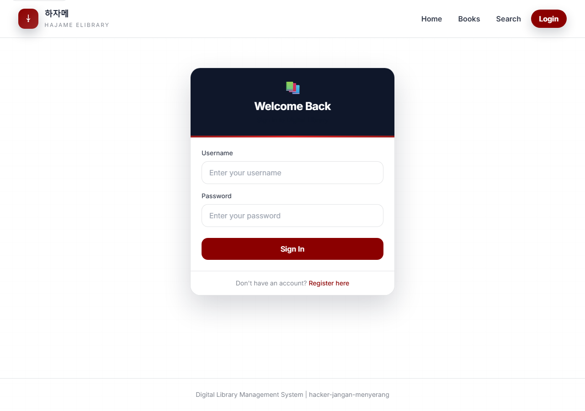 |
| Member Dashboard | 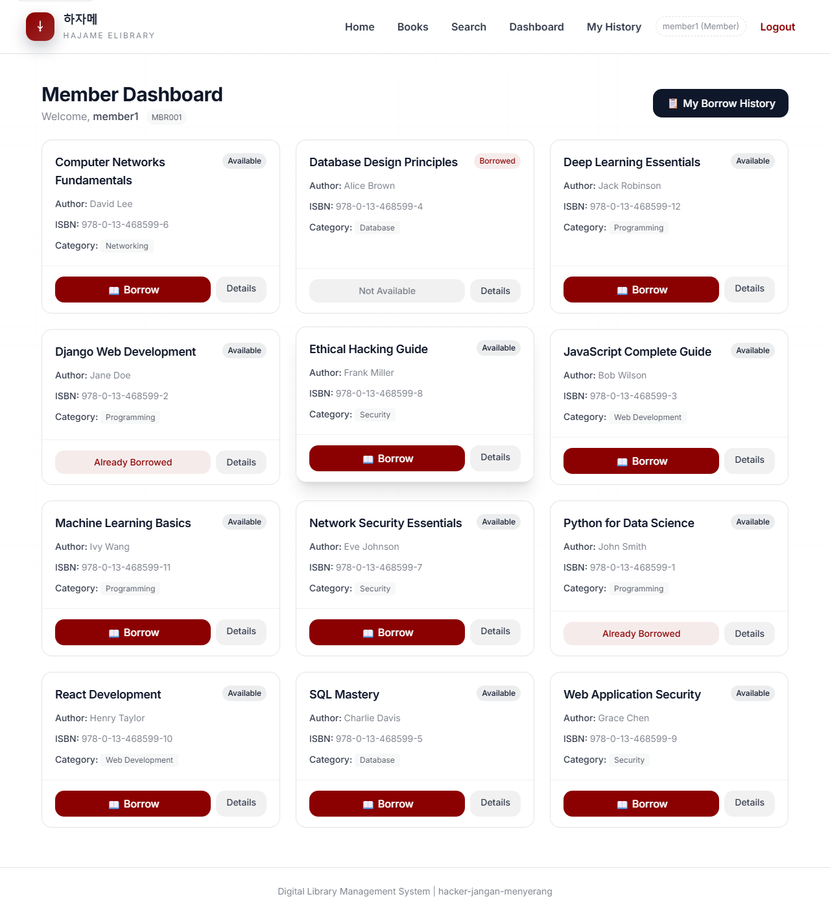 |
| Borrow Confirmation | 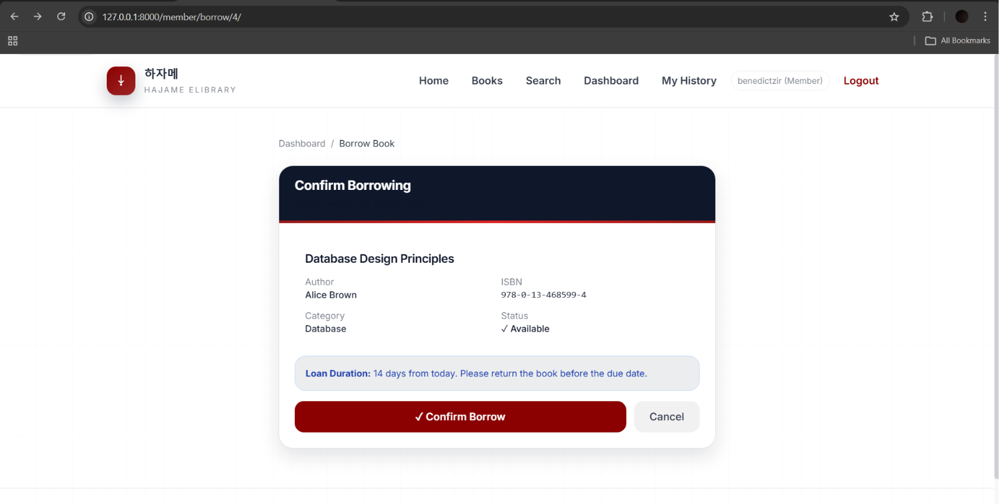 |
| Borrow History | 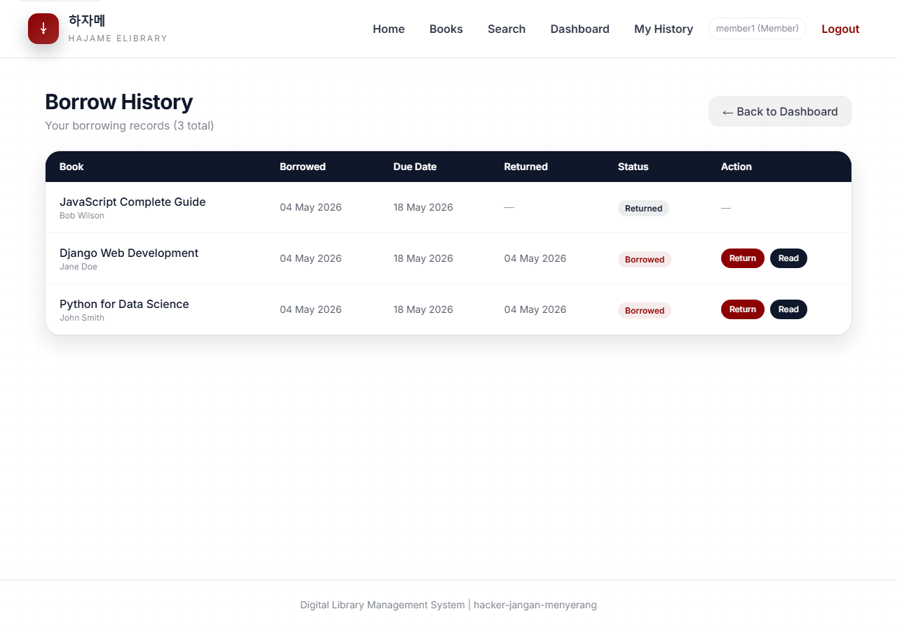 |
| Return Confirmation | 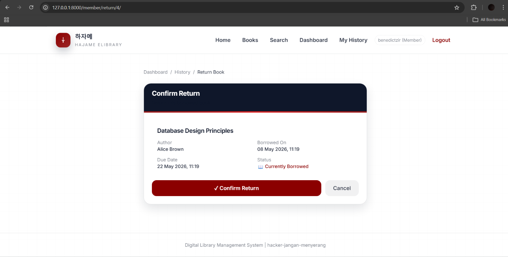 |
| Librarian Dashboard | 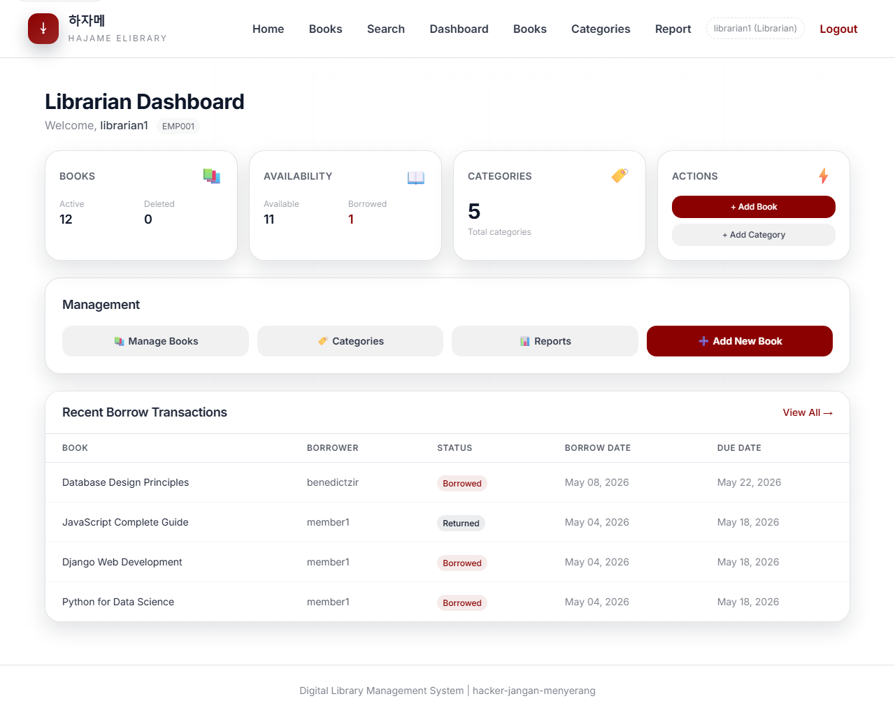 |
| Admin Dashboard | 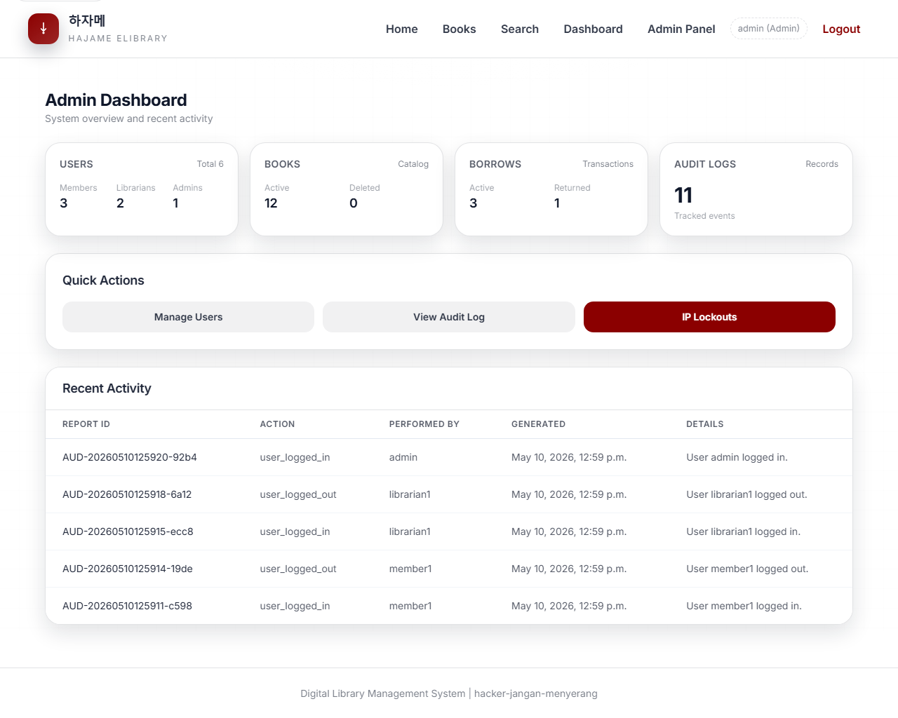 |
| Audit Log | 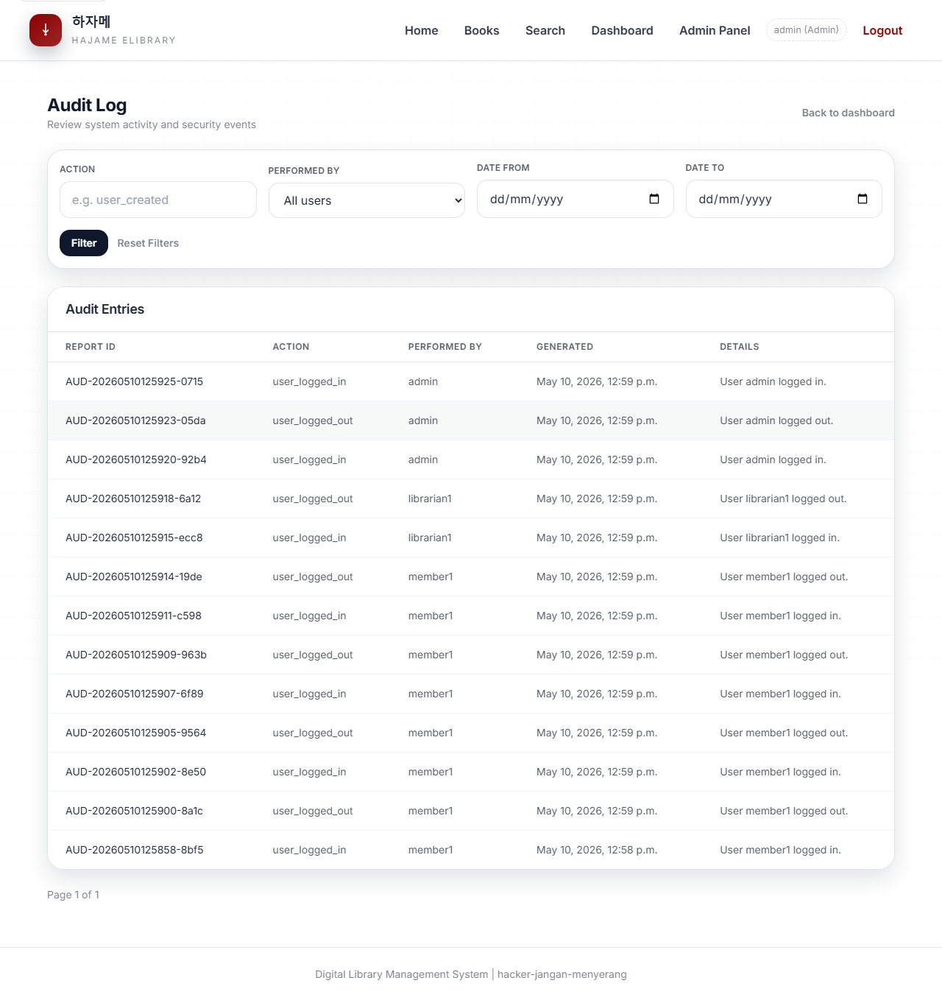 |
| 403 Forbidden (least privilege demo) | 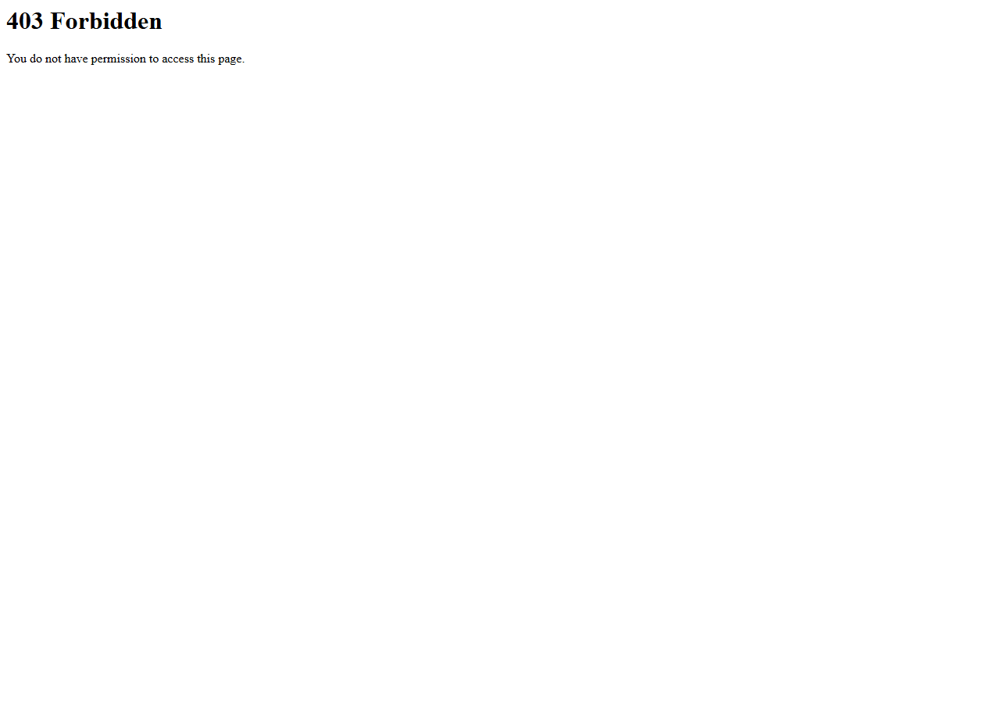 |

---

## 4. Hasil Test Case

Semua test dijalankan dengan:
```bash
python manage.py test main.tests --verbosity=2
```

| TC-ID | Deskripsi | Precondition | Expected Result | Status |
|-------|-----------|--------------|-----------------|--------|
| **TC-SQLI-01** | Search dengan payload `' OR '1'='1'--` | DB berisi buku normal | Mengembalikan 0 hasil (payload di-escape ORM) | ✅ PASS |
| **TC-SQLI-02** | Login dengan username `admin' --` (SQL injection bypass) | User admin ada di DB | Login gagal — ORM tidak bisa di-bypass | ✅ PASS |
| **TC-SQLI-03** | Search dengan `; DROP TABLE book;--` | DB berisi buku | Tidak ada efek — tabel tetap ada | ✅ PASS |
| **TC-AUTH-01** | Login gagal 6x berturut-turut | Akun aktif, AXES dikonfigurasi | Percobaan ke-6 mendapat pesan lockout | ✅ PASS |
| **TC-AUTH-02** | Cek format password di DB | User terdaftar | Password tersimpan dalam format `pbkdf2_sha256$...` (bukan plaintext) | ✅ PASS |
| **TC-AUTH-03** | Logout, kemudian coba akses halaman member | User sedang login | Session tidak valid — redirect ke login | ✅ PASS |
| **TC-CSRF-01** | POST `/member/borrow/<id>/` tanpa CSRF token | Member login, buku tersedia | 403 Forbidden | ✅ PASS |
| **TC-CSRF-02** | POST dengan CSRF token salah/invalid | Member login | 403 Forbidden | ✅ PASS |
| **TC-CSRF-03** | POST dengan CSRF token valid | Member login, buku tersedia | 302 Redirect — borrow berhasil | ✅ PASS |
| **TC-IDOR-01** | Member A coba return buku milik Member B | Dua member berbeda, buku dipinjam Member B | 404 Not Found — ownership check mencegah akses | ✅ PASS |
| **TC-XSS-01** | Librarian tambah buku dengan title `<script>alert(1)</script>` | Librarian login | Form ditolak (regex validator menolak `<` dan `>`) | ✅ PASS |
| **TC-XSS-02** | Tambah kategori dengan payload XSS | Librarian login | Form ditolak (allowlist validator aktif) | ✅ PASS |
| **TC-INPUT-01** | Submit form tambah buku tanpa field wajib | Librarian login | Form ditolak dengan pesan error validasi | ✅ PASS |
| **TC-FILE-01** | Upload file `.exe` yang di-rename menjadi `.pdf` | Librarian login | Upload ditolak (MIME type check mendeteksi EXE) | ✅ PASS |
| **TC-ADMIN-01** | Member GET `/admin-panel/` | Member login | 403 Forbidden | ✅ PASS |
| **TC-ADMIN-02** | Librarian GET `/admin-panel/users/` | Librarian login | 403 Forbidden | ✅ PASS |
| **TC-ADMIN-03** | Admin GET `/admin-panel/users/` | Admin login | 200 OK — daftar user tampil | ✅ PASS |
| **TC-ADMIN-04** | Admin POST create user → cek DB dan AuditLog | Admin login | User ada di DB + entri `user_created` di audit_logs | ✅ PASS |
| **TC-ADMIN-05** | Admin POST toggle active pada akun sendiri | Admin login | Diblokir — `is_active` tetap `True`, pesan error tampil | ✅ PASS |
| **TC-ADMIN-06** | Admin ubah role member menjadi librarian | Admin login, member aktif | Role berubah di DB + entri `user_role_changed` di audit_logs | ✅ PASS |
| **TC-ADMIN-07** | `create_audit_log()` dengan details mengandung `'password'` | — | `ValueError` dilempar — tidak tersimpan ke DB | ✅ PASS |

---

## 5. Petunjuk Instalasi

```bash
# 1. Clone repository
git clone https://github.com/hacker-jangan-menyerang/Tugas-3.git
cd Tugas-3

# 2. Buat virtual environment
python -m venv venv

# 3. Aktifkan virtual environment
# Windows:
venv\Scripts\activate
# Linux/Mac:
source venv/bin/activate

# 4. Install dependencies
pip install -r requirements.txt

# 5. Buat file .env (opsional — ada default dev key)
cp .env.example .env  # atau buat manual

# 6. Jalankan migrasi
python manage.py migrate

# 7. Seed database dengan data demo
python seed.py

# 8. Jalankan server
python manage.py runserver
# Akses di: http://127.0.0.1:8000/
```

> **Catatan:** `requirements.txt` menyertakan `psycopg2-binary` yang tidak digunakan — runtime database adalah SQLite. Entri tersebut dapat diabaikan dan tidak mempengaruhi jalannya aplikasi.

### Default Credentials (dari seed.py)

| Username | Password | Role |
|----------|----------|------|
| `admin` | `admin123` | admin |
| `librarian1` | `librarian123` | librarian |
| `librarian2` | `librarian123` | librarian |
| `member1` | `member123` | member |
| `member2` | `member123` | member |

### Menjalankan Test

```bash
# Semua test
python manage.py test main.tests --verbosity=2

# Satu kelas test saja
python manage.py test main.tests.AdminFeatureTests --verbosity=2

# Satu method saja
python manage.py test main.tests.AdminFeatureTests.test_tc_admin_01_member_blocked_from_admin_panel -v 2
```

---

## 6. Link Video Demo

YouTube (Unlisted): [https://youtu.be/C7Hx3mI3DoA](https://youtu.be/C7Hx3mI3DoA)

---

## 7. Laporan Unit Testing

Unit testing menggunakan framework bawaan Django (`django.test.TestCase`), dijalankan dengan:

```bash
python manage.py test main --verbosity=2
```

Total **53 test** lulus dengan hasil **OK (0 failure, 0 error)**:

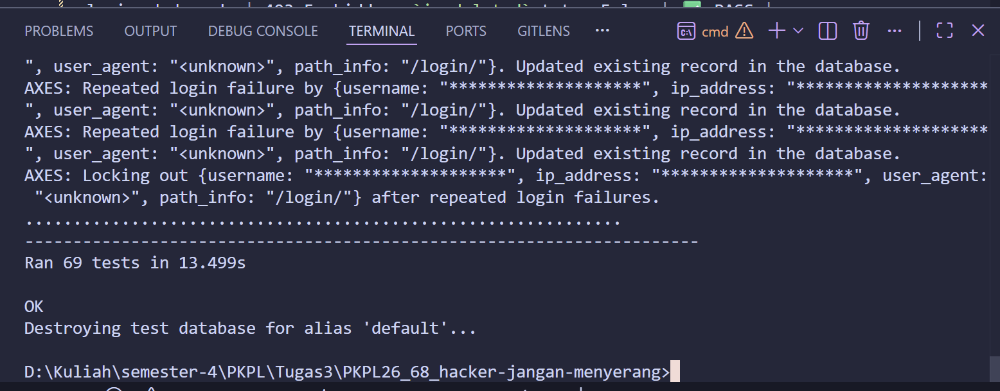

Subbab berikut menjelaskan test per topik keamanan (penomoran mengikuti Bagian 2).

### 7.1 Code Injection Prevention (CWE-79 / 20 / 94) — Roberto Eugenio Sugiarto (2406355640)

**Diuji:** form validasi librarian ([`main/librarian_forms.py`](main/librarian_forms.py)) dan template auto-escaping. **Test:** `XSSPreventionTests`, `InputValidationTests`, `FileUploadSecurityTests` di `main/tests.py`, semua PASS.

#### `XSSPreventionTests` — Pencegahan XSS pada Form Librarian

| Method | TC-ID | Yang diuji | Cara kerja | Hasil yang diharapkan |
|--------|-------|------------|------------|----------------------|
| `test_tc_xss_01_script_tag_in_book_title` | TC-XSS-01 | Allowlist regex pada title (CWE-79) | POST tambah buku dengan title `<script>alert(1)</script>` | Form ditolak (bukan `302`); tidak ada buku dengan `<script>` di DB |
| `test_tc_xss_02_xss_in_category_name` | TC-XSS-02 | Allowlist regex pada category name (CWE-79) | POST tambah kategori dengan `` | Form ditolak; tidak ada kategori XSS di DB |
| `test_xss_in_description_stripped` | — | HTML tag stripping di description (CWE-79) | POST buku dengan description `Hello <script>alert("xss")</script> world` | Jika berhasil tersimpan, `<script>` sudah dihapus; hanya teks `Hello world` tersimpan |
| `test_auto_escaping_in_template` | — | Django auto-escaping (CWE-79) | Buat buku langsung ke DB dengan title `<script>` → GET halaman daftar buku | Response HTML mengandung `&lt;script&gt;` bukan `<script>` — tag tidak dieksekusi browser |

Dua lapis pertahanan yang diuji: (1) regex allowlist di `BookForm` / `CategoryForm` menolak karakter `<`, `>` sebelum masuk database; (2) jika data berbahaya masuk DB secara langsung, Django auto-escaping memastikan tag dirender sebagai teks, bukan dieksekusi.

#### `InputValidationTests` — Validasi Field Wajib dan Format (CWE-20)

| Method | TC-ID | Yang diuji | Hasil yang diharapkan |
|--------|-------|------------|----------------------|
| `test_tc_input_01_missing_required_fields` | TC-INPUT-01 | Field title/author/isbn kosong | Form ditolak; 0 buku dibuat di DB |
| `test_isbn_only_numbers_and_hyphens` | — | ISBN dengan karakter `ABC-INVALID` | Form ditolak; hanya format `[0-9\-]` diterima |

#### `FileUploadSecurityTests` — Validasi File Upload eBook (CWE-94)

| Method | TC-ID | Yang diuji | Cara kerja | Hasil yang diharapkan |
|--------|-------|------------|------------|----------------------|
| `test_tc_file_01_exe_disguised_as_pdf` | TC-FILE-01 | MIME type check (extension ≠ content) | Upload file dengan ekstensi `.pdf` tapi header konten `MZ` (EXE magic bytes) | File ditolak atau disimpan tanpa ekstensi `.exe`; tidak ada file EXE tersimpan di server |
| `test_exe_extension_rejected` | — | Extension allowlist | Upload file `malware.exe` langsung | Form ditolak — ekstensi `.exe` tidak masuk allowlist `.pdf/.epub/.txt` |

### 7.2 Broken Authentication Mitigation (CWE-287 / 307 / 256 / 384) — Kevin Cornellius Widjaja (2406428781)

**Diuji:** alur login & logout ([`main/auth_views.py`](main/auth_views.py)), registrasi ([`main/auth_views.py`](main/auth_views.py), [`main/forms.py`](main/forms.py)), dan dekorator RBAC ([`main/decorators.py`](main/decorators.py)). **Test:** [`main/tests.py`](main/tests.py), 9 test, semua PASS.

[Screenshot hasil test AuthenticationTests](assets/images/auth_unittest_pass.png)

#### `AuthenticationTests` — Rate Limiting, PBKDF2, Session Invalidation

Kelas ini memverifikasi tiga kontrol keamanan inti pada alur autentikasi (CWE-287 / 307 / 256 / 384):

| Method | TC-ID | Yang diuji | Cara kerja | Hasil yang diharapkan |
|--------|-------|------------|------------|----------------------|
| `test_tc_auth_01_login_lockout_after_5_failures` | TC-AUTH-01 | Rate limiting (CWE-307) | POST `/login/` dengan password salah sebanyak 7 kali; setiap percobaan dicatat oleh `django-axes`. Setelah 5 kali gagal, `axes` memblokir IP dan mengembalikan HTTP 429. | Setidaknya satu respons dalam rangkaian percobaan harus `429`; tidak ada percobaan yang berhasil masuk (bukan `200` dashboard) |
| `test_tc_auth_02_password_is_pbkdf2_hash` | TC-AUTH-02 | Penyimpanan password (CWE-256) | Membaca field `password` dari objek `User` di DB. Memverifikasi format `pbkdf2_sha256$<iterations>$<salt>$<hash>` (4 segmen dipisah `$`). | `user.password.startswith('pbkdf2_sha256$')` = `True`; nilai bukan plaintext `'testpass123'` |
| `test_tc_auth_03_session_invalidated_after_logout` | TC-AUTH-03 | Session management (CWE-384) | Login → simpan nilai `sessionid` → POST `/logout/` → buat client baru dengan cookie `sessionid` lama → GET `/member/`. | Respons adalah `302` ke `/login/`, bukan `200` (session lama tidak valid) |

Konfigurasi terkait di [`elibrary/settings.py`](elibrary/settings.py):
```python
AXES_FAILURE_LIMIT     = 5                       # lockout setelah 5 gagal
AXES_COOLOFF_TIME      = timedelta(minutes=15)   # durasi lockout
AXES_RESET_ON_SUCCESS  = True                    # reset counter saat login berhasil
SESSION_COOKIE_HTTPONLY = True                   # cegah akses JS ke cookie
SESSION_COOKIE_AGE      = 3600                   # session kedaluwarsa 1 jam
```

#### `RegisterFormTests` — Validasi Form Registrasi

| Method | Yang diuji | Hasil yang diharapkan |
|--------|------------|----------------------|
| `test_register_creates_user_with_role` | POST `/register/` dengan data member valid → user tersimpan ke DB dengan `role='member'` dan `membership_number` sesuai input | `302` redirect ke `/login/`; user ada di DB |
| `test_register_librarian_requires_employee_id` | POST dengan `role='librarian'` dan `employee_id` valid | `302` success; user tersimpan |
| `test_password_mismatch_validation` | POST dengan `password='pass123'` dan `password_confirm='differentpass'` | Bukan `302`; kata "password" muncul di halaman (pesan error) |

Form validasi diimplementasikan di [`main/forms.py`](main/forms.py) — method `clean()` membandingkan `password` dan `password_confirm`, melempar `ValidationError` jika tidak cocok.

#### `RoleRequiredDecoratorTests` — RBAC via `@role_required`

| Method | Yang diuji | Hasil yang diharapkan |
|--------|------------|----------------------|
| `test_member_cannot_access_librarian_view` | Member GET `/member/` (halaman khusus member) | `200 OK` — member bisa akses halaman role-nya sendiri |
| `test_librarian_cannot_access_member_only_view` | Librarian GET `/member/` | `403 Forbidden` — dekorator menolak role yang tidak cocok |
| `test_unauthenticated_access_redirects` | Unauthenticated GET `/member/` | `302` ke `/login/` — dekorator redirect jika belum login |

Dekorator `@role_required(*roles)` di [`main/decorators.py`](main/decorators.py) pertama memeriksa `request.user.is_authenticated`; jika tidak, redirect ke login. Kemudian memeriksa `request.user.role in roles`; jika tidak, mengembalikan `HttpResponseForbidden('403 Forbidden')`.

#### Coverage — `main` module

Dijalankan dengan:
```bash
python -m coverage run --source=main manage.py test main
python -m coverage report -m
```

Hasil:

| Module | Stmts | Miss | Cover |
|--------|-------|------|-------|
| `main/auth_views.py` | 122 | 12 | **90%** |
| `main/decorators.py` | 14 | 0 | **100%** |
| `main/forms.py` | 37 | 5 | 86% |
| `main/models.py` | 71 | 4 | 94% |
| `main/signals.py` | 25 | 3 | 88% |
| **TOTAL** | **1410** | **308** | **78%** |

`auth_views.py` mencapai 90% — 12 baris yang tidak tertutup adalah cabang error minor (mis. path redirect saat user sudah login membuka `/login/`). `decorators.py` 100% karena seluruh alur (authenticated + role cocok, authenticated + role salah, unauthenticated) dicakup oleh `RoleRequiredDecoratorTests` dan `RoleAccessTests`.

### 7.3 CSRF & IDOR Protection (CWE-352 / 639) — Benedictus Lucky Win Ziraluo (2406355174)

**Diuji:** proteksi CSRF pada endpoint borrow/return dan pencegahan IDOR pada return/history. **Test:** `CSRFProtectionTests` dan `IDORPreventionTests` di `main/tests.py`, semua PASS.

**Ringkas hasil uji:**

| Kelas Test | Yang diuji | Hasil |
|-----------|-----------|-------|
| `CSRFProtectionTests` | POST tanpa token dan token salah pada `/member/borrow/<id>/` dan `/member/return/<id>/` | 403 Forbidden; token valid berhasil (borrow sukses, redirect) |
| `IDORPreventionTests` | Return transaksi milik member lain + history | Return milik member lain 404; history hanya menampilkan transaksi milik sendiri |

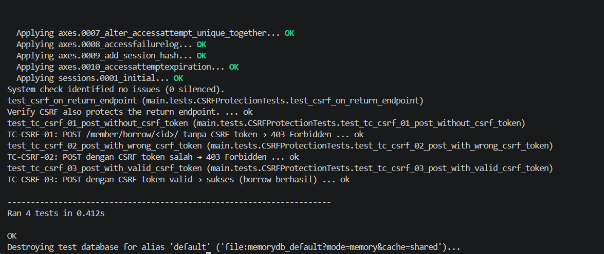
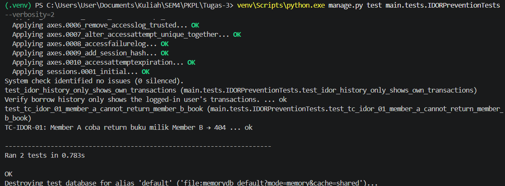

### 7.4 SQL Injection Prevention (CWE-89) — Vincent Valentino Oei (2406353225)

**Diuji:** view `search_books` ([`main/search_views.py`](main/search_views.py)) dan alur login ([`main/auth_views.py`](main/auth_views.py), [`main/forms.py`](main/forms.py)). **Test:** [`main/tests.py`](main/tests.py), 8 test, semua PASS.

Semua query database memakai Django ORM (parameterized query), sehingga payload injeksi hanya dianggap teks biasa (mitigasi CWE-89). Sebagai lapisan kedua, form login membatasi username dengan allowlist `^[a-zA-Z0-9_]+$`.

| Kelas Test | Yang diuji | Hasil |
|-----------|-----------|-------|
| `SQLInjectionSearchTests` | Payload `' OR '1'='1'--`, `'; DROP TABLE book;--`, dan `UNION SELECT` pada pencarian | Payload jadi teks biasa, hasil 0, tabel utuh, tidak ada data bocor |
| `SQLInjectionLoginTests` | Username `admin'--` dll. pada form login | Ditolak validasi, login gagal |
| `SQLInjectionModelTests` | Inspeksi kode search view | Tanpa `cursor.execute`, memakai `Q()` ORM |

### 7.5 Privilege Escalation Mitigation (CWE-269 / 285 / 862) — Galih Nur Rizqy (2406343224)

**Diuji:** kontrol akses berbasis role di seluruh panel admin ([`main/admin_views.py`](main/admin_views.py)), decorator RBAC ([`main/decorators.py`](main/decorators.py)), dan audit log ([`main/audit.py`](main/audit.py)). **Test:** `AdminFeatureTests`, `RoleAccessTests`, `LibrarianRBACTests` di `main/tests.py`, semua PASS.


#### `AdminFeatureTests` — Kontrol Akses Admin Panel (TC-ADMIN-01..07)

Kelas ini memverifikasi bahwa panel admin hanya dapat diakses dan dioperasikan oleh user dengan role `admin`, serta bahwa setiap aksi admin dicatat di `AuditLog` tanpa credential leakage (CWE-269 / 285 / 862):

| Method | TC-ID | Yang diuji | Cara kerja | Hasil yang diharapkan |
|--------|-------|------------|------------|----------------------|
| `test_tc_admin_01_member_blocked_from_admin_panel` | TC-ADMIN-01 | Least privilege (CWE-285) | Member `force_login` → GET `/admin-panel/` | `403 Forbidden` — `@role_required('admin')` menolak role `member` |
| `test_tc_admin_02_librarian_blocked_from_user_list` | TC-ADMIN-02 | Least privilege (CWE-285) | Librarian `force_login` → GET `/admin-panel/users/` | `403 Forbidden` — librarian tidak punya akses admin |
| `test_tc_admin_03_admin_can_list_users` | TC-ADMIN-03 | Akses sah (CWE-862) | Admin `force_login` → GET `/admin-panel/users/` | `200 OK` + username user lain terlihat di response body |
| `test_tc_admin_04_create_user_logs_audit` | TC-ADMIN-04 | Akuntabilitas (CWE-862) | Admin POST create user baru → cek DB dan AuditLog | User ada di DB + `AuditLog` berisi entri `user_created` |
| `test_tc_admin_05_admin_cannot_deactivate_self` | TC-ADMIN-05 | Self-modification protection (CWE-269) | Admin POST toggle active pada `user_id` dirinya sendiri | `is_active` tetap `True`; response bukan `200` tanpa pesan sukses |
| `test_tc_admin_06_role_change_logged` | TC-ADMIN-06 | Akuntabilitas role change (CWE-862) | Admin ubah role member → cek DB dan AuditLog | Role berubah di DB + entri `user_role_changed` di `audit_logs` |
| `test_tc_admin_07_audit_log_no_password_leak` | TC-ADMIN-07 | Credential leakage prevention (CWE-532) | Panggil `create_audit_log()` dengan `details` mengandung substring `'password'` | `ValueError` dilempar — data tidak tersimpan ke DB |

Implementasi perlindungan self-deactivation di [`main/admin_views.py`](main/admin_views.py):
```python
if target_user.id == request.user.id:
    messages.error(request, 'You cannot deactivate your own account.')
    return redirect('main:user_detail', user_id=target_user.id)
```

Perlindungan credential leakage di [`main/audit.py`](main/audit.py):
```python
if any(kw in details.lower() for kw in ('password', 'token')):
    raise ValueError("AuditLog.details must not contain credentials.")
```

#### `RoleAccessTests` — Cross-Role Access Prevention

Kelas ini memverifikasi bahwa setiap role hanya bisa mengakses halaman miliknya dan diblokir dari halaman role lain:

| Method | Yang diuji | Hasil yang diharapkan |
|--------|------------|----------------------|
| `test_member_can_access_member_dashboard` | Member GET `/member/` | `200 OK` |
| `test_librarian_cannot_access_member_dashboard` | Librarian GET `/member/` | `403 Forbidden` |
| `test_unauthenticated_redirects_to_login` | Unauthenticated GET `/member/` | `302` ke `/login/` |

#### `LibrarianRBACTests` — Librarian Role Isolation

Kelas ini memverifikasi bahwa kontrol akses berlaku pada fitur librarian — librarian bisa akses dashboard-nya sendiri, tapi member dan user anonim tidak bisa:

| Method | Yang diuji | Hasil yang diharapkan |
|--------|------------|----------------------|
| `test_librarian_can_access_dashboard` | Librarian GET `/librarian/` | `200 OK` |
| `test_member_cannot_access_librarian_dashboard` | Member GET `/librarian/` | `403 Forbidden` |
| `test_member_cannot_add_book` | Member POST `/librarian/books/add/` | `403 Forbidden` |
| `test_unauthenticated_redirects` | Unauthenticated GET `/librarian/` | `302` ke `/login/` |

---

## 8. Laporan Pentesting

Pentesting dilakukan dalam 5 tahapan sesuai ketentuan tugas. Target uji: aplikasi yang berjalan di `http://127.0.0.1:8000/`.

### 8.1 Reconnaissance (Passive & Active) — Vincent Valentino Oei (2406353225)

Tools: nmap, curl, OWASP ZAP. Target: `http://127.0.0.1:8000/`.

**Teknologi aplikasi:** Django (dev server WSGIServer, Python 3.12), database SQLite, rate limiting django-axes, frontend Tailwind CSS via CDN, password hashing PBKDF2.

**Daftar endpoint** (ringkasan dari [Bagian 1](#1-deskripsi-aplikasi)):

- Publik dan Member: `/register/`, `/login/`, `/logout/`, `/books/`, `/books/search/`, `/books/<id>/`, `/member/borrow/<id>/`, `/member/return/<id>/`, `/member/history/`, `/member/read/<id>/`
- Librarian: `/librarian/`, `/librarian/books/`, `/librarian/categories/`, `/librarian/report/`
- Admin: `/admin-panel/`, `/admin-panel/users/`, `/admin-panel/users/<id>/role/`, `/admin-panel/audit-log/`, `/admin-panel/lockouts/`

**nmap** (`nmap -sV -p 8000 -A 127.0.0.1`): port 8000 terbuka, server `WSGIServer/0.2 CPython/3.12.10` (versi bocor).

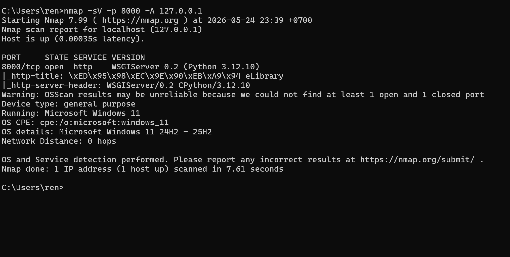

**curl** (`curl -I`): header `X-Frame-Options`, `X-Content-Type-Options`, `Referrer-Policy`, dan COOP sudah ada; CSP dan HSTS belum ada.

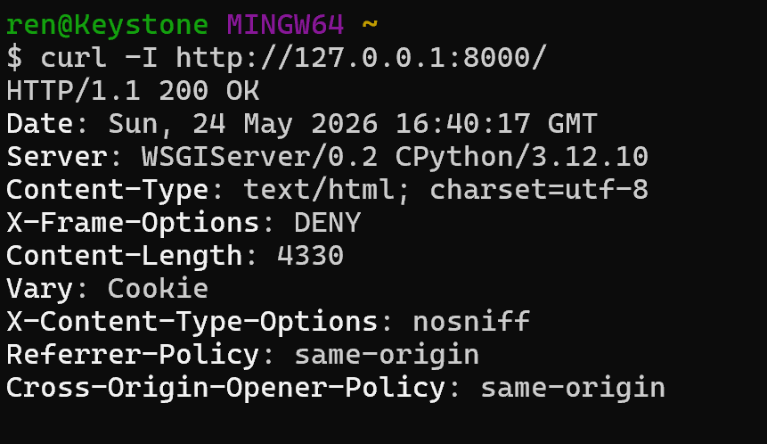

**OWASP ZAP** (passive scan): 10 alert, yaitu 0 High, 2 Medium (CSP dan SRI tidak diset), 4 Low, 4 Info. Laporan lengkap: [`assets/zap_report.html`](assets/zap_report.html).

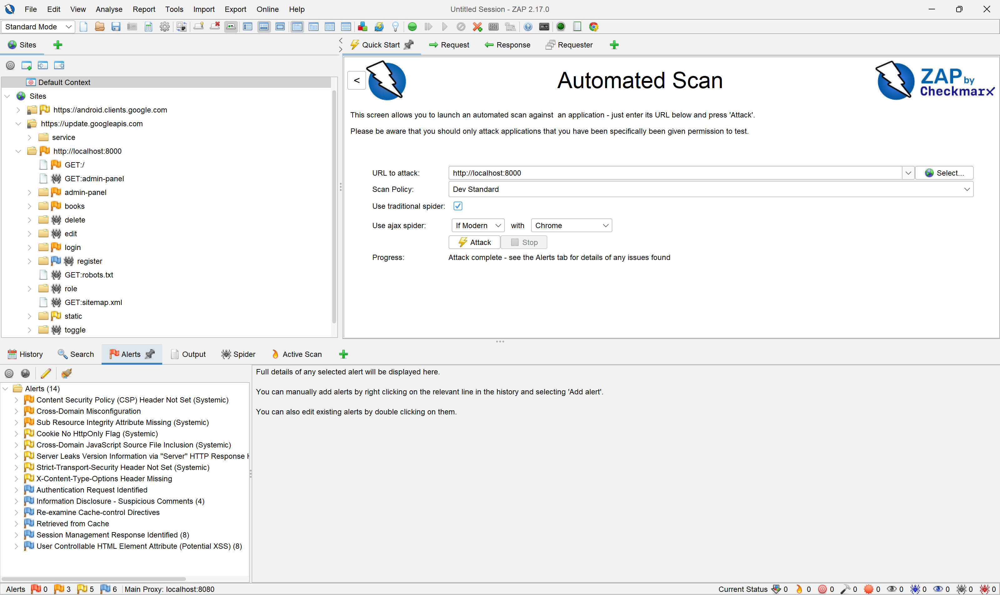

Kesimpulan: tidak ada temuan High. Isu utama yaitu CSP dan HSTS belum diset serta server version disclosure (melengkapi config bug Bagian 8.4).

### 8.2 Threat Modeling

**Data Flow Diagram (DFD):**

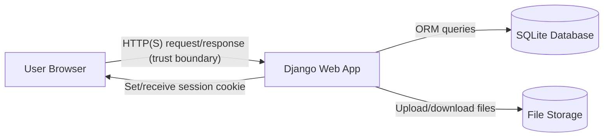
```mermaid
flowchart LR
    U[User Browser]
    W[Django Web App]
    DB[(SQLite Database)]
    FS[(File Storage)]

    U -- "HTTP(S) request/response (trust boundary)" --> W
    W -- "ORM queries" --> DB
    W -- "Upload/download files" --> FS
    W -- "Set/receive session cookie" --> U
```

**Trust boundaries:**

- Browser <-> Django app (public network, attacker-controlled client).
- Django app <-> Database/File storage (internal server boundary).

**STRIDE per halaman/fitur (pemetaan ke CWE):**

| Halaman/Fitur | STRIDE | CWE | Contoh ancaman |
|--------------|--------|-----|----------------|
| Login (`/login/`) | Spoofing | CWE-287 | Kredensial ditebak/credential stuffing untuk menyamar sebagai user lain |
| Login (`/login/`) | DoS | CWE-307 | Brute force berulang menyebabkan lockout atau gangguan layanan |
| Register (`/register/`) | Elevation | CWE-269 | Tampering parameter role untuk mendaftar sebagai admin/librarian |
| Search (`/books/search/`) | Tampering / Info Disclosure | CWE-89 | SQL injection untuk membaca data sensitif |
| Borrow/Return (`/member/borrow/<id>/`, `/member/return/<id>/`) | Tampering | CWE-352 | CSRF memaksa user meminjam/return tanpa consent |
| Borrow/Return (`/member/return/<id>/`, `/member/history/`) | Info Disclosure / Elevation | CWE-639 | IDOR akses transaksi milik member lain |
| Librarian book/category forms (`/librarian/books/`, `/librarian/categories/`) | Tampering | CWE-79, CWE-20 | XSS atau input berbahaya pada judul/kategori |
| Admin/Librarian pages (`/admin-panel/`, `/librarian/`) | Elevation | CWE-285 | Akses halaman privileged tanpa otorisasi |

### 8.3 Scanning & Enumeration

Scanning dilakukan dengan dua tool: **OWASP ZAP** (otomatis) dan **curl** (manual header inspection).

**OWASP ZAP Passive Scan** dijalankan terhadap `http://127.0.0.1:8000/` dengan autentikasi sebagai member. Hasilnya: **0 High, 2 Medium, 4 Low, 4 Informational**.

Alert Medium:
- *Content Security Policy (CSP) Header Not Set* — CSP tidak diset, membuka potensi XSS via inline script dari CDN.
- *Sub Resource Integrity (SRI) Not Set* — Tailwind CSS dimuat dari CDN tanpa integrity hash; file CDN yang dikompromikan bisa menjalankan script berbahaya.

Alert Low (ringkasan):
- *Server Leaks Version Information via "Server" HTTP Response Header*
- *Missing Anti-clickjacking Header* (X-Frame-Options sudah ada via Django SecurityMiddleware, ZAP versi ini masih flag)
- *Strict-Transport-Security Header Not Set*
- *X-Content-Type-Options Header Missing* (sebagian endpoint)

Laporan lengkap: [`assets/zap_report.html`](assets/zap_report.html).


**curl header inspection** (`curl -I http://127.0.0.1:8000/login/`) mengkonfirmasi response headers yang ada dan yang tidak ada:


Tidak ditemukan endpoint yang mengembalikan data SQL error atau stack trace pada input berbahaya — semua payload diproses melalui Django ORM dan dikembalikan sebagai 0 hasil atau form error biasa.

### 8.4 Exploitation & Testing

Setiap pemilik topik mendemonstrasikan serangan pada fiturnya langsung di browser dan menunjukkan bahwa serangan gagal/diblokir.

#### SQL Injection (CWE-89) — Vincent Valentino Oei (2406353225)

Empat payload SQL injection diuji langsung melalui endpoint pencarian (`/books/search/`) dan form login. Semua gagal karena aplikasi memperlakukan payload sebagai teks biasa (memakai Django ORM, parameterized query).

**1. Boolean-based, `' OR '1'='1'--`:** pencarian mengembalikan 0 hasil, bukan seluruh tabel.

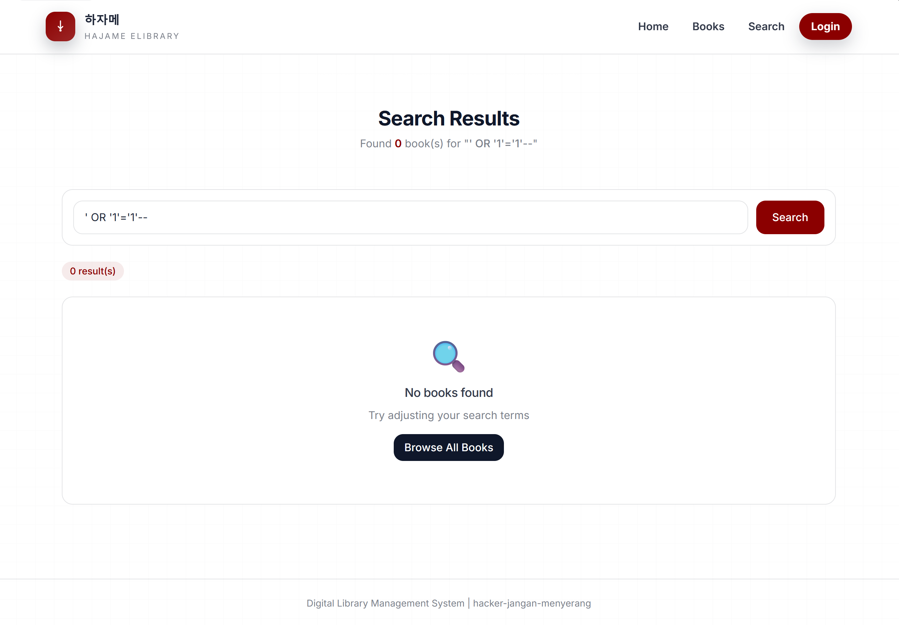

**2. Stacked query / DROP TABLE, `'; DROP TABLE books;--`:** 0 hasil, tanpa error, dan tabel tetap utuh (DROP tidak dieksekusi).

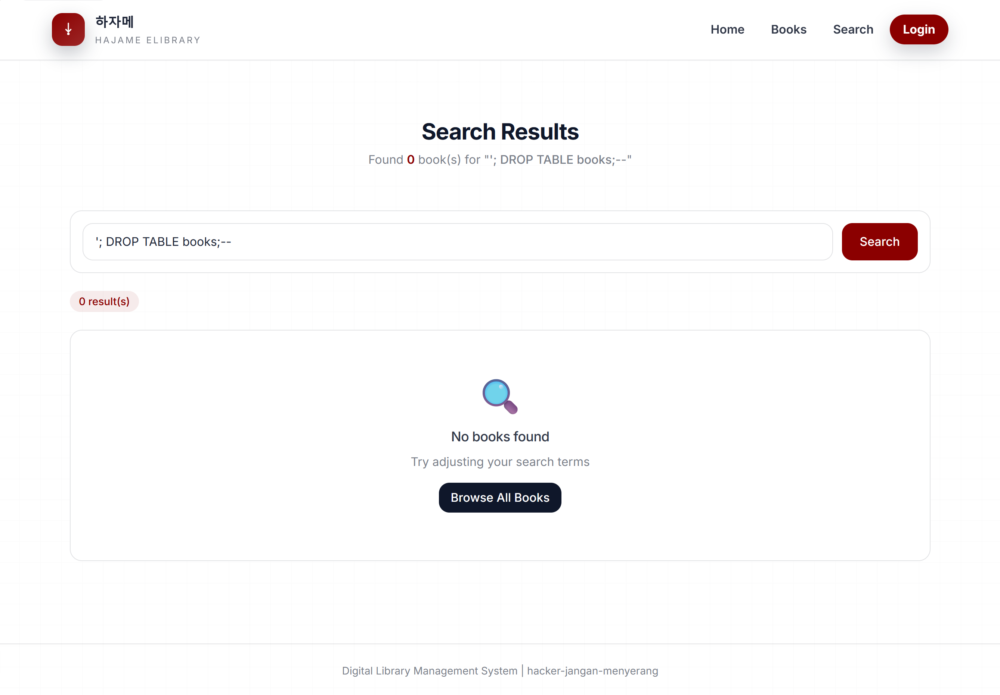

**3. UNION-based, `' UNION SELECT username,password FROM users--`:** 0 hasil, tidak ada username atau password yang bocor.

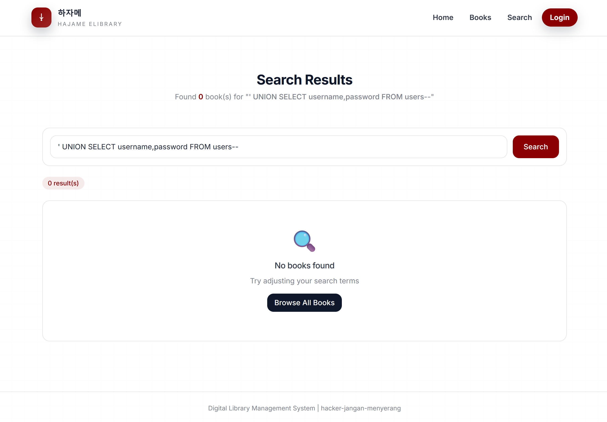

**4. Authentication bypass, login username `admin'--`:** login gagal. Username ditolak allowlist regex pada form login dan tidak pernah mencapai database (terverifikasi pada unit test TC-SQLI-02, lihat Bagian 7.4).

**Temuan (F-SQLI):**

| ID | Serangan | CWE | Status | Bukti |
|----|----------|-----|--------|-------|
| F-SQLI-01 | Boolean-based injection (`' OR '1'='1'--`) pada search | CWE-89 | Aman, 0 hasil | `sqli_pentest_1.png` |
| F-SQLI-02 | Stacked query `DROP TABLE` pada search | CWE-89 | Aman, tabel utuh | `sqli_pentest_2.png` |
| F-SQLI-03 | UNION-based data exfiltration pada search | CWE-89 | Aman, tidak ada data bocor | `sqli_pentest_3.png` |
| F-SQLI-04 | Auth bypass login `admin'--` | CWE-89 | Aman, ditolak validasi/ORM | Unit test TC-SQLI-02 (Bagian 7.4) |

Kesimpulan: tidak ditemukan kerentanan SQL injection. Seluruh input dieksekusi melalui Django ORM, diperkuat validasi input allowlist pada form login.

#### CSRF & IDOR (CWE-352 / 639) — Benedictus Lucky Win Ziraluo (2406355174)

CSRF diuji dengan request POST manual saat login member; request tanpa token dan token salah ditolak (403). IDOR diuji dengan mencoba return transaksi milik member lain dan menghasilkan 404.

**1. CSRF token missing:** POST `/member/borrow/<id>/` tanpa token -> 403 Forbidden.

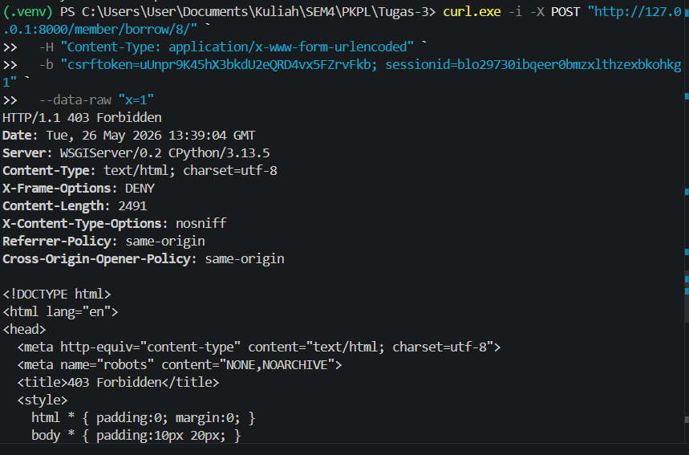

**2. CSRF token invalid:** POST `/member/borrow/<id>/` dengan token salah -> 403 Forbidden.

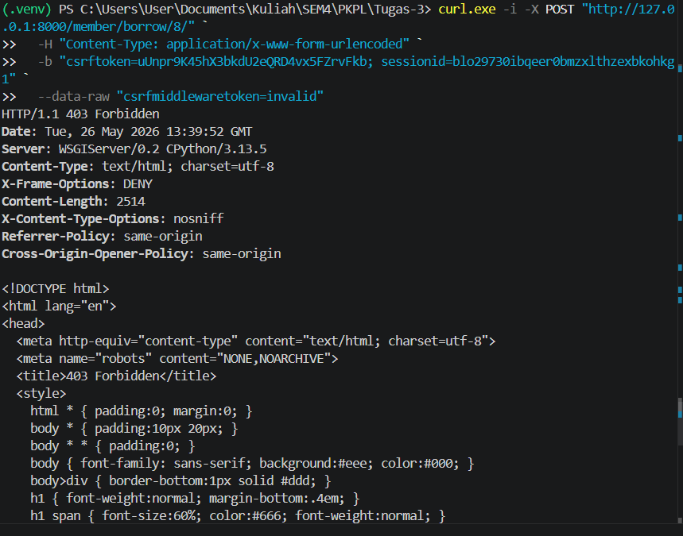

**3. IDOR return milik member lain:** Member A mengakses `/member/return/<id>/` milik Member B -> 404 Not Found.

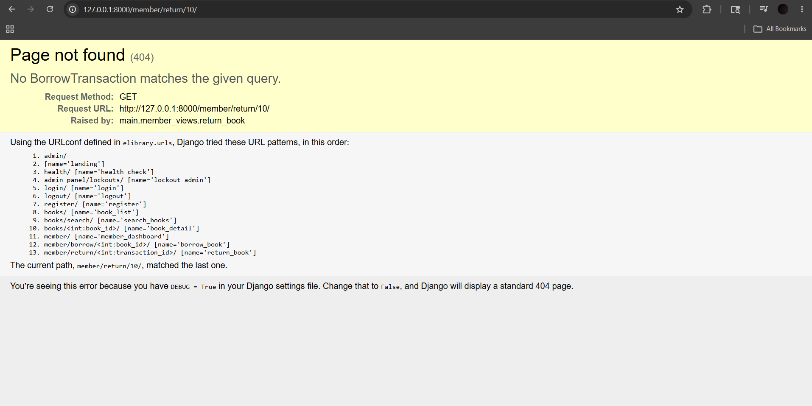

**Temuan (F-CSRF):**

| ID | Serangan | CWE | Status | Bukti |
|----|----------|-----|--------|-------|
| F-CSRF-01 | CSRF token missing pada borrow | CWE-352 | Aman, 403 | `csrftokenmissing.png` |
| F-CSRF-02 | CSRF token invalid pada borrow | CWE-352 | Aman, 403 | `csrftokeninvalid.png` |
| F-CSRF-03 | IDOR return milik member lain | CWE-639 | Aman, 404 | `idortest.png` |

#### Broken Authentication (CWE-287 / 307 / 256 / 384) — Kevin Cornellius Widjaja (2406428781)

Tiga skenario serangan diuji langsung pada aplikasi yang berjalan di `http://127.0.0.1:8000/`.

**1. Brute-force login → Account Lockout (TC-AUTH-01)**

Username `member1` digunakan dengan password salah secara berulang melalui form login `/login/`. Setelah percobaan ke-5, `django-axes` memblokir IP. Percobaan ke-6 mengembalikan halaman dengan pesan lockout (HTTP 429) dan tidak mengizinkan masuk meskipun password benar.

Konfigurasi: `AXES_FAILURE_LIMIT = 5`, `AXES_COOLOFF_TIME = timedelta(minutes=15)`.

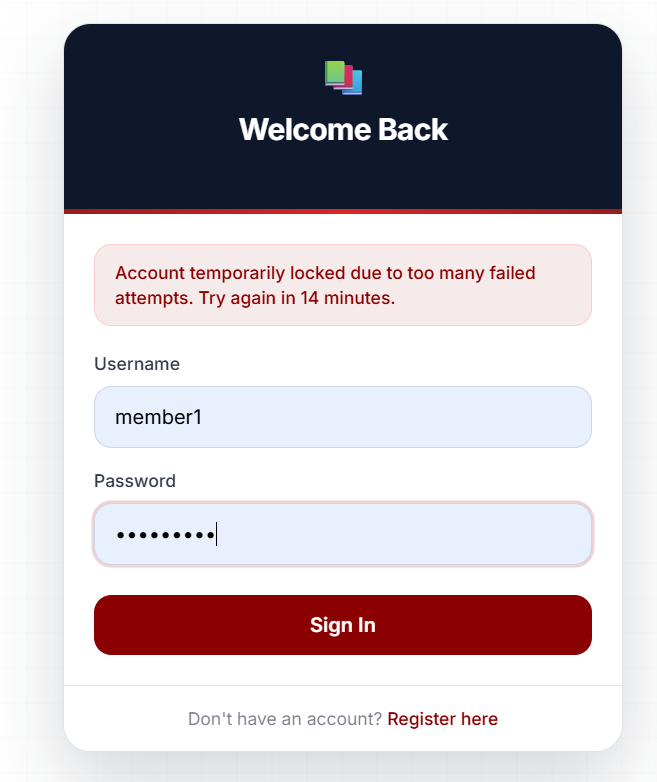

**2. Cek kolom password di database — PBKDF2 hash (TC-AUTH-02)**

Kolom `password` pada tabel `users` diperiksa langsung di `db.sqlite3`. Hasilnya:
```
admin      | pbkdf2_sha256$1200000$<salt>$<hash>
librarian1 | pbkdf2_sha256$1200000$<salt>$<hash>
```
Tidak ada satu pun akun yang menyimpan password dalam bentuk plaintext. Django secara otomatis menggunakan PBKDF2-SHA256 dengan 1.200.000 iterasi melalui `create_user()`.

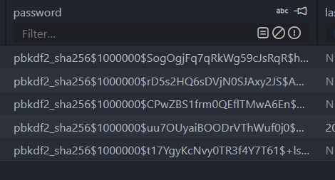

**3. Reuse session cookie setelah logout (TC-AUTH-03)**

Prosedur: (a) login sebagai `member1`, catat nilai cookie `sessionid` dari DevTools; (b) klik Logout; (c) buka tab Incognito, set cookie `sessionid` ke nilai lama, akses `/member/`. Hasilnya: browser di-redirect ke `/login/` — session lama tidak dikenali server karena `logout()` memanggil `session.flush()` yang menghapus data sesi dari store.

Implementasi `session.flush()` pada logout view:

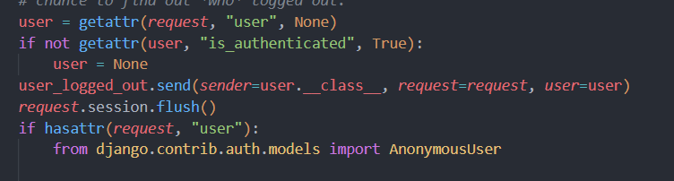

**Temuan (F-AUTH):**

| ID | Serangan | CWE | Severity | Status | Bukti | Rekomendasi |
|----|----------|-----|----------|--------|-------|-------------|
| F-AUTH-01 | Brute-force login (> 5 percobaan gagal) | CWE-307 | High | **Aman** — HTTP 429 setelah 5 gagal | `auth_login_locked.png`, TC-AUTH-01 | Konfigurasi sudah tepat; pertimbangkan notifikasi email kepada pemilik akun saat lockout |
| F-AUTH-02 | Password disimpan plaintext di database | CWE-256 | Critical | **Aman** — PBKDF2-SHA256 1.2M iterasi | `auth_pbkdf_hashed.png`, TC-AUTH-02 | Tidak ada tindakan lanjut; sudah best-practice |
| F-AUTH-03 | Reuse session token setelah logout (session fixation) | CWE-384 | High | **Aman** — session lama diinvalidasi | `auth_logout_code.png`, TC-AUTH-03 | Sudah aman; tambahkan `SESSION_COOKIE_SECURE = True` saat deploy ke HTTPS |
| F-AUTH-04 | Tidak ada pembatasan role pada `/register/` | CWE-287 | Medium | **Rentan** — siapapun bisa daftar sebagai Admin/Librarian | Lihat form registrasi | Batasi pilihan role di `/register/` ke `member` saja; Admin/Librarian dibuat via admin panel |

Kesimpulan: tiga dari empat kontrol autentikasi sudah terimplementasi dengan baik. Satu temuan nyata (F-AUTH-04): form registrasi mengekspos semua pilihan role — pada sistem produksi harus dibatasi ke `member` saja.


#### Privilege Escalation & Misconfiguration (CWE-269 / 285 / 862) — Galih Nur Rizqy (2406343224)

Pengujian dilakukan dalam dua kelompok: (a) verifikasi kontrol akses RBAC dan (b) temuan konfigurasi nyata yang menjadi celah keamanan.

##### A. RBAC Testing

**1. Member mencoba akses `/admin-panel/` (TC-ADMIN-01)**

Login sebagai `member1 / member123`, navigasi langsung ke `http://127.0.0.1:8000/admin-panel/`. Django mengembalikan 403 Forbidden karena decorator `@role_required('admin')` menolak role `member`.


**2. Librarian mencoba akses `/admin-panel/users/` (TC-ADMIN-02)**

Login sebagai `librarian1 / librarian123`, navigasi ke `/admin-panel/users/`. Django mengembalikan 403 Forbidden — librarian tidak memiliki role `admin`.

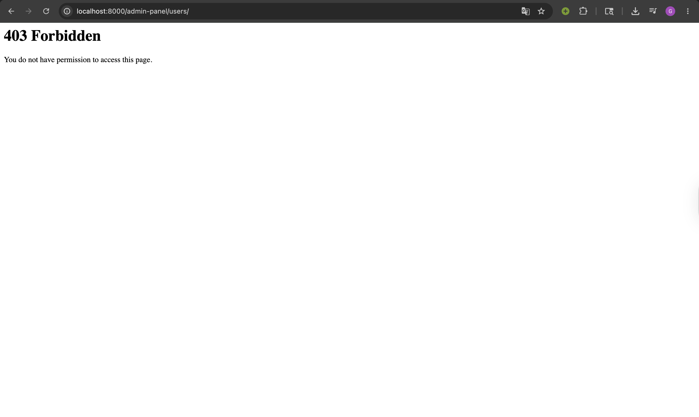

**3. Admin tidak bisa deactivate dirinya sendiri (TC-ADMIN-05)**

Login sebagai `admin / admin123`, masuk ke halaman user list. Tombol Deactivate untuk akun admin sendiri tidak ditampilkan di UI (UI-level protection). Backend juga menolak POST request langsung via curl:

```bash
curl -c cookies.txt -b cookies.txt -s \
  -X POST http://localhost:8000/admin-panel/users/1/toggle/ \
  -d "csrfmiddlewaretoken=<token>" \
  -H "Referer: http://localhost:8000/admin-panel/users/" \
  -w "\nHTTP Status: %{http_code}\n"
```

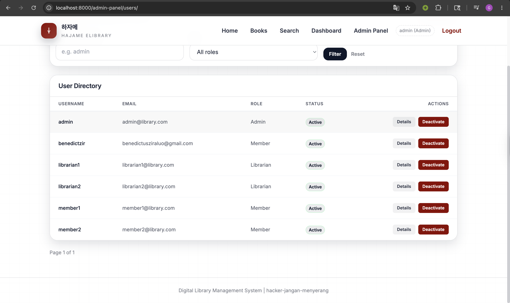

##### B. Config Vulnerability Findings

**Finding F-PRIV-01 — DEBUG=True (Information Disclosure)**

`elibrary/settings.py` baris `DEBUG = os.getenv('DEBUG', 'True') == 'True'` — default bernilai `True`. Saat URL tidak ditemukan, Django menampilkan halaman debug penuh berisi path file server, versi library, dan konfigurasi environment.

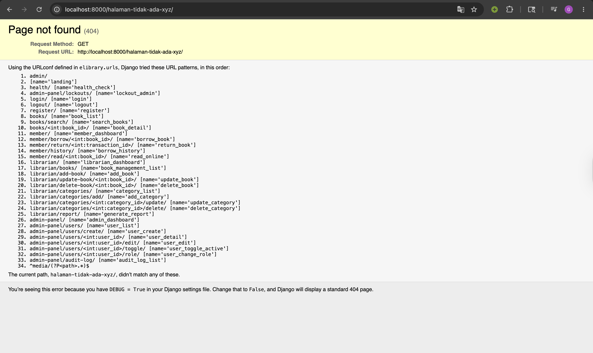

**Finding F-PRIV-02 — Missing Security Headers**

Response headers aplikasi tidak mengandung `Content-Security-Policy`, `Strict-Transport-Security`, atau `X-Content-Type-Options`. Dikonfirmasi via DevTools → Network → Response Headers.

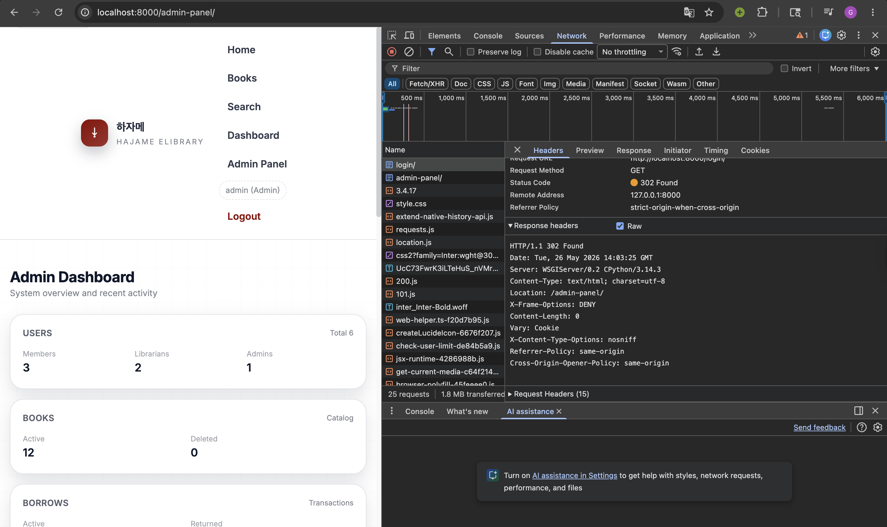

**Finding F-PRIV-03 — Self-Registration Sebagai Role Privileged**

Halaman `/register/` menampilkan semua pilihan role termasuk `Admin` dan `Librarian`. User anonim dapat mendaftar langsung sebagai Admin dan mengakses seluruh panel admin.

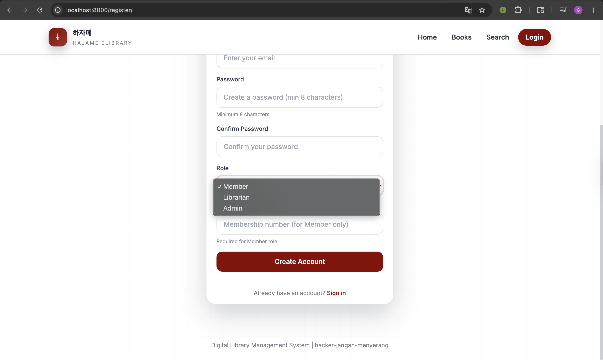

**Finding F-PRIV-04 — Akun Admin Hasil Self-Register Bisa Akses Panel Admin**

Setelah mendaftar dengan role Admin melalui `/register/`, akun baru berhasil login dan mengakses `/admin-panel/` dengan penuh.

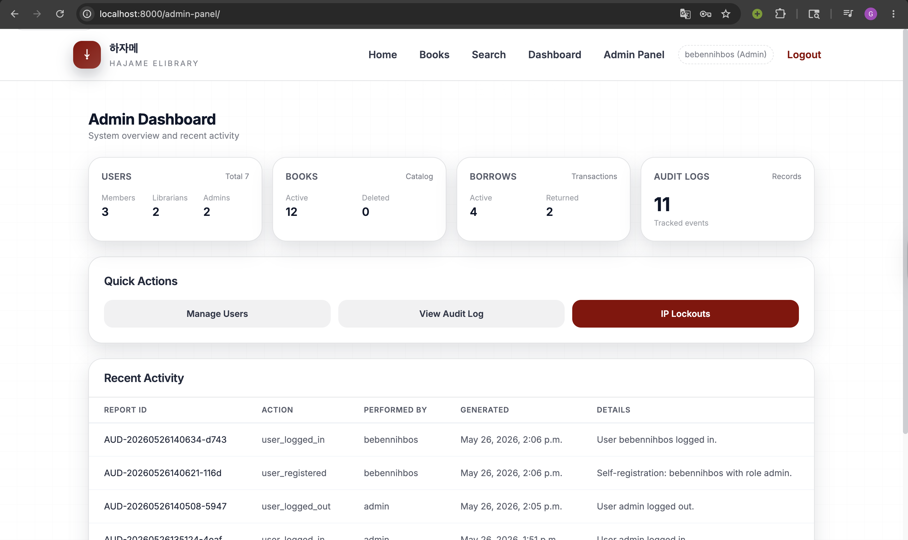

**Temuan (F-PRIV):**

| ID | Temuan | CWE | Severity | Status | Bukti | Rekomendasi |
|----|--------|-----|----------|--------|-------|-------------|
| F-PRIV-01 | Member/Librarian dapat akses halaman admin via URL langsung | CWE-285 | High | **Aman** — 403 Forbidden oleh `@role_required('admin')` | `rbac_1.png`, `rbac_2.png`, TC-ADMIN-01, TC-ADMIN-02 | Sudah terimplementasi |
| F-PRIV-02 | Admin bisa self-deactivate (self-lockout) | CWE-269 | Medium | **Aman** — diblokir UI + backend check | `rbac_3.png`, TC-ADMIN-05 | Sudah terimplementasi |
| F-PRIV-03 | `DEBUG=True` — halaman error bocorkan info internal | CWE-215 | Medium | **Rentan** — stack trace terekspos | `config_bugs_1.png` | Set `DEBUG=False` di production; gunakan env var |
| F-PRIV-04 | Missing `Content-Security-Policy` dan `Strict-Transport-Security` | CWE-693 | Medium | **Rentan** — header tidak ada | `config_bugs_2.png`, ZAP alerts | Tambah `django-csp`; set `SECURE_HSTS_SECONDS` di settings |
| F-PRIV-05 | Self-registration ke role Admin/Librarian via `/register/` | CWE-269 | High | **Rentan** (by design untuk demo) | `config_bugs_3.png`, `config_bugs_4.png` | Batasi ChoiceField ke `member` saja; Admin/Librarian dibuat via admin panel |

### 8.5 Reporting & Remediation

> _TODO (Roberto): tabel temuan gabungan (`F-*`) dari semua topik + saran perbaikan untuk bug yang nyata._

---

## Appendix

### Entity Relationship Diagram (ERD)

ERD dapat dilihat di: https://dbdiagram.io/d/69f8c2f6ddb9320fdccf8b33

### Database Schema

| Table | Description |
|-------|-------------|
| `users` | User accounts dengan role (member/librarian/admin), employee_id, membership_number |
| `books` | Book catalog dengan soft delete, status (available/not_available) |
| `categories` | Book categories |
| `borrow_transactions` | Transaction tracking dengan employee_id & membership_number untuk accountability |
| `audit_logs` | Audit trail dengan report_id unique dan generated_date |

### OCL Invariants

| Invariant | Implementation |
|-----------|---------------|
| `ValidStatusIntegrity` | Book.status ∈ {'available', 'not_available'} |
| `ValidTransactionStatus` | BorrowTransaction.status ∈ {'borrowed', 'returned'} |
| `AccountabilityEmployeeTracked` | employee_id NOT NULL untuk librarian |
| `AccountabilityMemberTracked` | membership_number NOT NULL untuk member |
| `AccountabilityAuditLogged` | report_id UNIQUE, generated_date NOT NULL |

### CWE References

| CWE | Nama | Mitigasi yang Diimplementasikan |
|-----|------|---------------------------------|
| **CWE-79** | XSS (Cross-site Scripting) | Allowlist regex, HTML tag stripping, Django auto-escape |
| **CWE-20** | Improper Input Validation | RegexValidator + MaxLengthValidator di semua form |
| **CWE-89** | SQL Injection | Django ORM Q objects, tanpa raw SQL |
| **CWE-287** | Improper Authentication | PBKDF2 hashing, session management |
| **CWE-307** | Brute Force | Rate limiting 5 percobaan = 15 menit lockout (django-axes) |
| **CWE-256** | Plaintext Password Storage | `create_user()` otomatis hash PBKDF2 |
| **CWE-352** | CSRF | CsrfViewMiddleware aktif, `` di semua form POST |
| **CWE-384** | Session Fixation | `session.flush()` saat logout, `SESSION_COOKIE_HTTPONLY=True` |
| **CWE-639** | IDOR | Ownership check `borrower=request.user` pada return & history |
| **CWE-269** | Improper Privilege Management | `@role_required` + self-modification protection |
| **CWE-285** | Improper Authorization | `@role_required` di setiap view yang memerlukan otorisasi |
| **CWE-862** | Missing Authorization | AuditLog mencatat semua aksi privileged untuk akuntabilitas |
